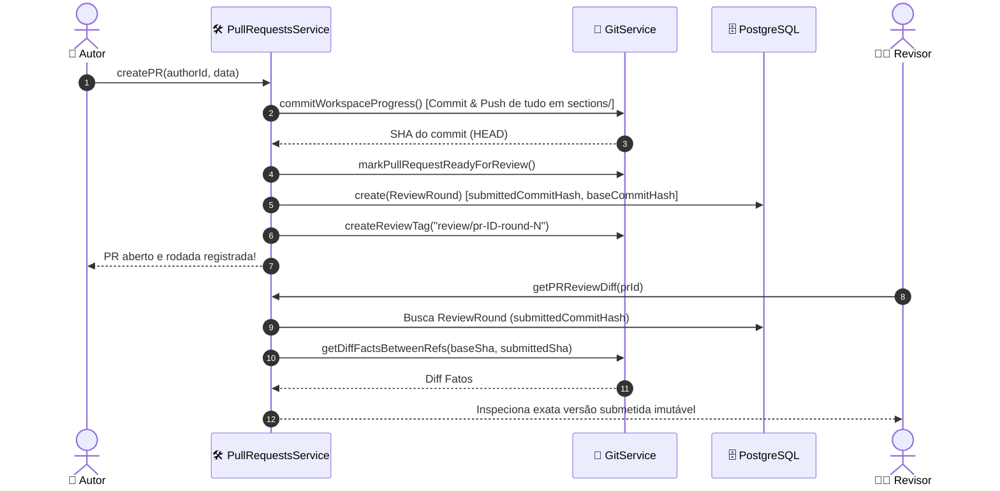

# Especificação Técnica do Serviço de Pull Requests & Rodadas de Revisão (PullRequestsService)

## 📌 Visão Geral & Filosofia de Arquitetura

O `PullRequestsService` é o serviço central de domínio acadêmico responsável pela gestão de **Pull Requests (PRs)**, **Rodadas de Revisão (`ReviewRound`)**, **Pareceres Institucionais (NIT)** e **Comentários de Revisão**.

Diferente do `GitService` (que lida com primitivas técnicas de infraestrutura Git/GitHub), o `PullRequestsService` encapsula a lógica de negócio acadêmica da plataforma SCI-LaTeX:

1. **Recipiente Técnico vs. Evento Acadêmico**:
   - **Pull Request (`PullRequest`)**: É o container de integração contínua (pode evoluir no GitHub com novos commits).
   - **Rodada de Revisão (`ReviewRound`)**: É o evento de submissão acadêmica **imutável**. Registra a fotografia exata (`submittedCommitHash` e `baseCommitHash`) do momento em que o Autor enviou o trabalho para avaliação.

2. **Garantia de Leitura Imutável**:
   - O Revisor inspeciona estritamente o SHA gravado na `ReviewRound` (`submittedCommitHash`), garantindo que alterações posteriores do Autor na branch não afetem a revisão em andamento.

3. **Isolamento de Presença (Redis)**:
   - A visualização de um PR por um Revisor registra presença no modo `review` (`workspace:active:review:...`), evitando bloquear o Autor (`isOccupied: false` para editores).

---

## 🏗️ Modelo de Dados (`Prisma Schema`)

### `PullRequest`
```prisma
model PullRequest {
  id             String          @id @default(uuid())
  title          String
  description    String?
  status         PRStatus        @default(DRAFT)
  nitStatus       NITStatus       @default(NOT_REQUIRED)
  nitNotes       String?
  sentToNitAt    DateTime?
  sentToNitNotes String?
  nitApprovedAt  DateTime?
  taskId         String?
  authorId       String
  reviewerId     String?
  projectId      String
  createdAt      DateTime        @default(now())
  updatedAt      DateTime        @updatedAt
  mergedAt       DateTime?

  task           Task?           @relation("TaskPullRequest", fields: [taskId], references: [id], onDelete: SetNull)
  author         User            @relation("AuthorPRs", fields: [authorId], references: [id])
  reviewer       User?           @relation("ReviewerPRs", fields: [reviewerId], references: [id])
  project        Project         @relation(fields: [projectId], references: [id], onDelete: Cascade)
  comments       ReviewComment[]
  rounds         ReviewRound[]
}
```

### `ReviewRound`
```prisma
model ReviewRound {
  id                          String          @id @default(uuid())
  pullRequestId               String
  roundNumber                 Int
  baseCommitHash              String
  submittedCommitHash         String
  previousSubmittedCommitHash String?
  createdAt                   DateTime        @default(now())

  pullRequest                 PullRequest     @relation(fields: [pullRequestId], references: [id], onDelete: Cascade)
  comments                    ReviewComment[]
}
```

---

## ⚡ Fluxo de Operações & Ciclo de Vida



---

## 📋 Métodos Principais do `PullRequestsService`

### 1. `createPR(authorId: string, data: CreatePRData)`
- **Descrição**: Abre ou promove um Pull Request para revisão técnica/entre pares.
- **Invariantes**:
  1. Executa `commitWorkspaceProgress` para garantir que todas as subpastas (`sections/*.tex`) sejam commitadas e enviadas ao remoto.
  2. Determina o `submittedCommitHash` (topo da branch da tarefa) e `baseCommitHash` (branch `dev`).
  3. Cria a `ReviewRound` sequencial (`roundNumber`, `previousSubmittedCommitHash`).
  4. Executa `createReviewTag` para gerar a tag remota de infraestrutura `review/pr-<id>-round-<N>`.
  5. Atualiza o status da `Task` para `UNDER_REVIEW`.

### 2. `getPRReviewDiff(prId: string)`
- **Descrição**: Retorna o diff estruturado da revisão para o painel do Revisor.
- **Invariantes**:
  - Utiliza o `submittedCommitHash` e `baseCommitHash` da última `ReviewRound` como referências estritas para o cálculo do diff.
  - Classifica alterações acadêmicas (seções TeX modificadas, adicionadas ou removidas).

### 3. `reviewPR(prId, reviewerId, status, comment, lineNumer)`
- **Descrição**: Registra parecer do Revisor (`APPROVED`, `CHANGES_REQUESTED`) e insere comentários associados à `ReviewRound`.
- **Invariantes**:
  - Sincroniza a avaliação no GitHub remoto via Octokit REST API se configurado.

### 4. `mergePR(prId, requesterId)`
- **Descrição**: Mescla a branch da tarefa na branch `dev` e exclui a branch temporária do autor.
- **Invariantes**:
  - Exige status `APPROVED`.
  - Apaga a branch da tarefa do remoto após o merge na `dev`.
  - Requisita a limpeza de Pods e PVCs inativos.

---

## 🔒 Garantias de Segurança e Resiliência

1. **Proteção Contra Inacessibilidade de Commit (`--force push`)**:
   - A criação da tag remota `review/pr-<prId>-round-<N>` garante que o SHA da submissão permaneça alcançável no repositório remanescente, evitando que o garbage collector do Git purge o commit.
2. **Presença Não Bloqueante no Redis**:
   - Conexões de visualização do Revisor usam `mode = 'review'`, não colidindo com as chaves `workspace:active:editor` consultadas por `isOccupied`.
