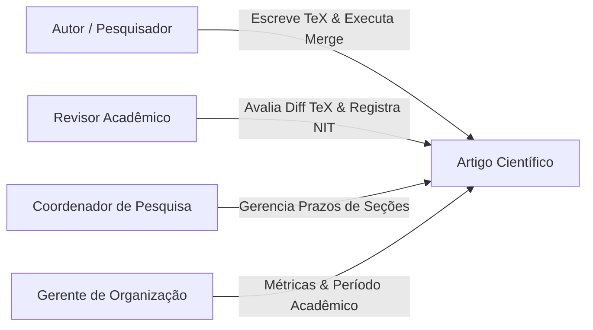
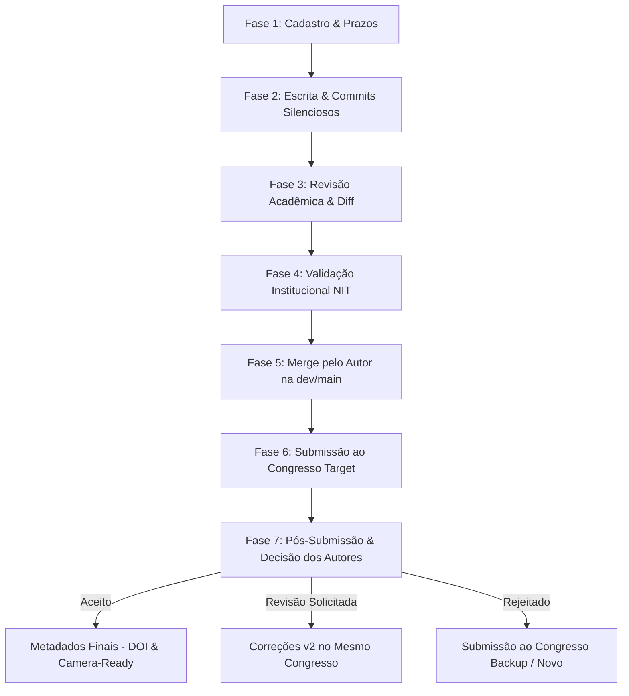

# 📄 Documento de Requisitos do Produto (PRD)

**Produto:** Plataforma Web de Escrita Científica Self-Hosted (`sci-latex-vscode`)  
**Versão:** 2.0 (Consolidada)  
**Status:** Em Desenvolvimento Ativo  

---

## 🎯 1. Visão do Produto & Problema

### O Problema
Pesquisadores e grupos de acadêmicos enfrentam desafios ao redigir artigos científicos em **LaTeX**:
* Necessidade de configuração complexa de ambiente TeX Live local.
* Falta de controle de versão formal e auditoria sobre alterações por seção.
* Ausência de integração com processos institucionais (como avaliação de propriedade intelectual pelo **NIT - Núcleo de Inovação Tecnológica**).
* Dificuldade no acompanhamento de prazos rígidos de conferências científicas e gerenciamento de congressos alvos e congressos backups.

### A Solução
O **`sci-latex-vscode`** é uma plataforma web **100% Self-Hosted** que disponibiliza um editor VS Code (`code-server`) totalmente embutido em um ambiente seguro e controlado (via **Kubernetes - KinD**), com:
* **Provisionamento Git Automatizado:** Repositórios criados no GitHub via Conta de Serviço (sem necessidade de chaves SSH para os usuários).
* **Compilação TeX Nativa:** Visualização instantânea de PDF lado a lado com auto-build no salvamento.
* **Fluxo de Revisão e NIT:** Módulo de Pull Requests, diff visual LaTeX, painel de comentários por linha e registro de parecer institucional NIT.
* **Governança por Prazos:** Dashboard com matrizes de prazos, notificações em tempo real (SSE) e visão por Período Acadêmico.

---

## 👥 2. Personas do Sistema & Atribuições

| Persona | Atribuições & Responsabilidades |
| :--- | :--- |
| **Autor** | Cria o artigo, estabelece prazos/congressos, escreve no editor VS Code, submete para revisão, atua em correções (v2), executa o Merge e decide o fluxo pós-submissão. |
| **Revisor** | Acessa workspace isolado de revisão, avalia o diff side-by-side (TeX/PDF), insere comentários por linha e registra o parecer institucional no NIT (`APPROVED_NIT`, `REJEITADO_NIT`). |
| **Coordenador** | Visão macro das equipes e projetos, gerenciamento e alteração de prazos de etapas e resolução de gargalos. |
| **Gerente** | Visão estratégica executiva por **Período Acadêmico** (ex: *2026/1*), taxa de aceitação em congressos alvos e backups, e papers finalizados com DOI. |

---

## 🔄 3. As 7 Fases do Ciclo de Vida do Artigo

1. **Fase 1 (Cadastro & Prazos):** Definição de título, autores, congresso alvo, congressos backups e prazos das seções.
2. **Fase 2 (Escrita & Commits):** Edição no VS Code embutido, auto-compilação em PDF e commits silenciosos na branch de trabalho (`task/SLV-X-...`).
3. **Fase 3 (Revisão Acadêmica):** Abertura de PR, congelamento visual da tarefa, visualização side-by-side do diff LaTeX pelo Revisor e apontamentos por linha.
4. **Fase 4 (Validação NIT):** Tramitação institucional e registro do parecer do Núcleo de Inovação Tecnológica.
5. **Fase 5 (Merge pelo Autor):** O Autor realiza a mesclagem da branch de trabalho após aprovação; limpeza automática do Pod/PVC isolado no K8s.
6. **Fase 6 (Submissão):** Envio oficial do artigo compilado para a conferência selecionada.
7. **Fase 7 (Pós-Submissão & Decisão):** Atualização do resultado (Aceito, Revisão Solicitada, Rejeitado) com encaminhamento para metadados finais (DOI), correções v2 ou redirecionamento para congresso backup.

---

## 🏗️ 4. Principais Decisões de Arquitetura (Consolidadas)

* **Editor Zen Mode (`code-server` em `<iframe>`):** Interface limpa de distração, sem Copilot/extensões externas, com `settings.json` centralizado e atalhos customizados.
* **Orquestração de Pods K8s On-Demand (KinD):** Warm pool de Pods pré-aquecidos para abertura instantânea do editor. Destruição do Pod e limpeza do PVC temporário após a realização do Merge na branch principal.
* **Backend Fastify & Projeções Locais no PostgreSQL:** Projeções enxutas (`GithubIssueProjection`, `GithubProjectItemProjection`) para alta performance nas consultas da Dashboard.
* **Sincronização em Tempo Real (SSE):** Atualização instantânea na interface ReactJS através de Server-Sent Events e React Query, sem necessidade de reload (F5).

---

## 🔗 5. Links para Especificações Detalhadas

* 📘 **Especificações Técnicas Completas:** [`docs/planning/specs/system-specs.md`](file:///home/gilson-russo/development/professional/sci-latex-vscode/docs/planning/specs/system-specs.md)
* 📐 **Arquitetura Geral & Infra:** [`docs/planning/specs/architecture-plan.md`](file:///home/gilson-russo/development/professional/sci-latex-vscode/docs/planning/specs/architecture-plan.md)
* ⚙️ **Especificações Backend:** [`docs/planning/specs/backend-specs.md`](file:///home/gilson-russo/development/professional/sci-latex-vscode/docs/planning/specs/backend-specs.md)
* 🎨 **Especificações Frontend:** [`docs/planning/specs/frontend-specs.md`](file:///home/gilson-russo/development/professional/sci-latex-vscode/docs/planning/specs/frontend-specs.md)
* 🛠️ **Workflow de Trabalho & Git:** [`docs/planning/WORKFLOW.md`](file:///home/gilson-russo/development/professional/sci-latex-vscode/docs/planning/WORKFLOW.md)
