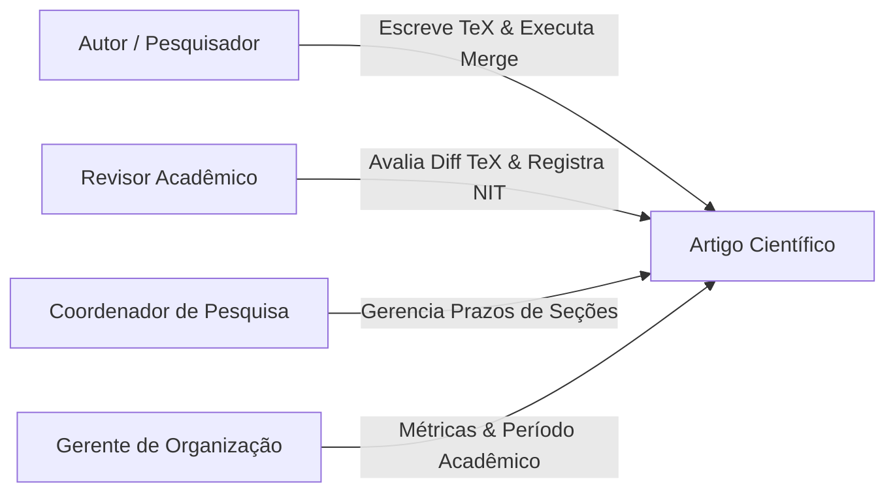
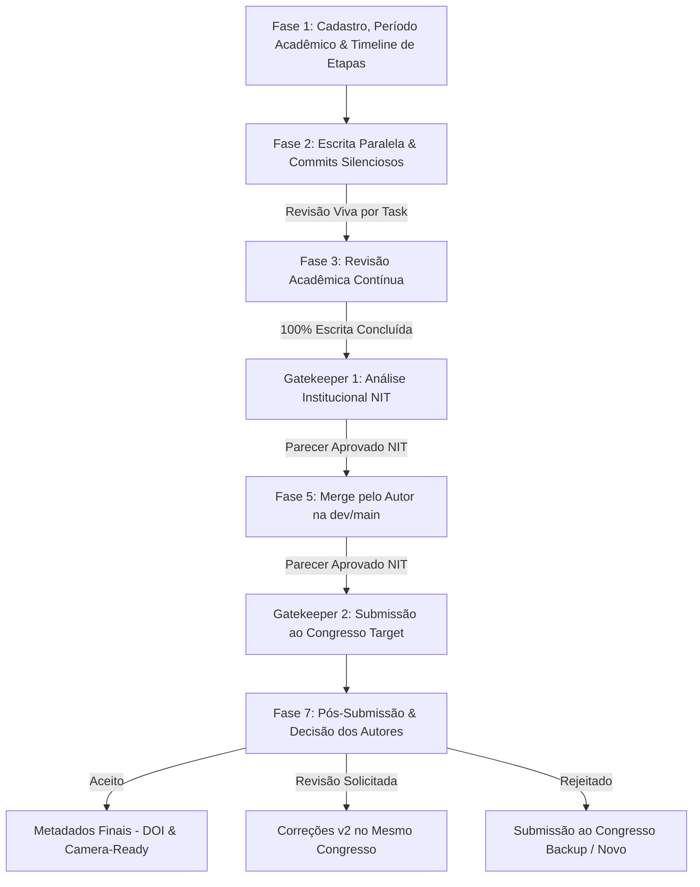

# 📄 Documento de Requisitos do Produto (PRD)

**Produto:** Plataforma Web de Escrita Científica Self-Hosted (`sci-latex-vscode`)  
**Versão:** 2.0 (Consolidada)  
**Status:** Em Desenvolvimento Ativo  

---

## 🎯 1. Visão do Produto & Problema

### O Problema
Pesquisadores e grupos de acadêmicos enfrentam desafios ao redigir artigos científicos em **LaTeX**:
* Necessidade de configuração complexa de ambiente TeX Live local.
* Falta de controle de versão formal e auditoria sobre alterações por seção.
* Ausência de integração com processos institucionais (como avaliação de propriedade intelectual pelo **NIT - Núcleo de Inovação Tecnológica**).
* Dificuldade no acompanhamento de prazos rígidos de conferências científicas e gerenciamento de congressos alvos e congressos backups.

### A Solução
O **`sci-latex-vscode`** é uma plataforma web **100% Self-Hosted** que disponibiliza um editor VS Code (`code-server`) totalmente embutido em um ambiente seguro e controlado (via **Kubernetes - KinD**), com:
* **Provisionamento Git Automatizado:** Repositórios criados no GitHub via Conta de Serviço (sem necessidade de chaves SSH para os usuários).
* **Compilação TeX Nativa:** Visualização instantânea de PDF lado a lado com auto-build no salvamento.
* **Fluxo de Revisão e NIT:** Módulo de Pull Requests, diff visual LaTeX, painel de comentários por linha e registro de parecer institucional NIT.
* **Governança por Prazos:** Dashboard com matrizes de prazos, notificações em tempo real (SSE) e visão por Período Acadêmico.

---

## 👥 2. Personas do Sistema & Atribuições

```mermaid
graph LR
    A[Autor / Pesquisador] -->|Escreve TeX & Executa Merge| P[Artigo Científico]
    R[Revisor Acadêmico] -->|Avalia Diff TeX & Registra NIT| P
    C[Coordenador de Pesquisa] -->|Gerencia Prazos de Seções| P
    G[Gerente de Organização] -->|Métricas & Período Acadêmico| P
```

| Persona | Atribuições & Responsabilidades |
| :--- | :--- |
| **Autor** | Cria o artigo, estabelece a timeline de etapas paralelas, escreve no editor VS Code, submete tarefas para revisão viva, atua em correções (v2), solicita análise do NIT (ao concluir 100% das etapas de escrita) e executa a submissão ao congresso. Pode colaborar em artigos de múltiplos times. |
| **Revisor** | Acessa workspace isolado de revisão, avalia o diff side-by-side (TeX/PDF), insere apontamentos por linha e aprova PRs de tarefas. Caso escreva um artigo próprio (auto-escrita), atua com privilégios de Autor naquele projeto (abertura de NIT e datas). |
| **Coordenador** | Coordena 1 ou mais Times (`1:N`). Gerencia cotas de artigos com a gerência, acompanha a régua de timeline de etapas paralelas e resolve gargalos das equipes. |
| **Gerente** | Suporte a **Múltiplos Gerentes (`Role.MANAGER`)** por departamento/área. Visão estratégica executiva por **Ciclo Acadêmico** do seu setor, define a Meta Global da sua unidade, distribui cotas entre os times sob sua gestão (`TeamAcademicGoal`), acompanha indicadores de superação de metas (*over-achievement*) e análise de gargalos nas etapas. |

---

## 🔄 3. As 7 Fases do Ciclo de Vida do Artigo

```mermaid
graph TD
    F1[Fase 1: Cadastro, Período Acadêmico & Timeline de Etapas] --> F2[Fase 2: Escrita Paralela & Commits Silenciosos]
    F2 -->|Revisão Viva por Task| F3[Fase 3: Revisão Acadêmica Contínua]
    F3 -->|100% Escrita Concluída| F4[Gatekeeper 1: Análise Institucional NIT]
    F4 -->|Parecer Aprovado NIT| F5[Fase 5: Merge pelo Autor na dev/main]
    F5 -->|Parecer Aprovado NIT| F6[Gatekeeper 2: Submissão ao Congresso Target]
    F6 --> F7[Fase 7: Pós-Submissão & Decisão dos Autores]
    
    F7 -->|Aceito| C1[Metadados Finais - DOI & Camera-Ready]
    F7 -->|Revisão Solicitada| C2[Correções v2 no Mesmo Congresso]
    F7 -->|Rejeitado| C3[Submissão ao Congresso Backup / Novo]
```

1. **Fase 1 (Cadastro, Período Acadêmico & Timeline de Etapas):** Associação ao Ciclo Acadêmico ativo, definição de título, autores, congresso alvo, backups e cronograma de etapas preliminares (`ProjectStage`).
2. **Fase 2 (Escrita Paralela & Commits):** Edição no VS Code embutido com execução paralela de seções/etapas, auto-compilação em PDF e commits silenciosos na branch de trabalho (`task/SLV-X-...`).
3. **Fase 3 (Revisão Acadêmica Contínua):** Processo vivo transversal acionado em cada `Task`. Abertura de Draft PR, visualização side-by-side do diff LaTeX pelo Revisor e apontamentos por linha.
4. **Fase 4 (Gatekeeper 1: Análise do NIT):** Trava sequencial estrita (`🔒 LOCKED`). Liberada para solicitação dos autores somente quando 100% das etapas de conteúdo de escrita estiverem concluídas.
5. **Fase 5 (Merge pelo Autor):** O Autor realiza a mesclagem da branch de trabalho após aprovação do Revisor e do NIT; limpeza automática do Pod/PVC isolado no K8s.
6. **Fase 6 (Gatekeeper 2: Submissão ao Congresso Target):** Trava sequencial estrita (`🔒 LOCKED`). Envio oficial do artigo compilado para a conferência selecionada após aprovação formal do NIT (`APPROVED_NIT`).
7. **Fase 7 (Pós-Submissão & Decisão):** Atualização do resultado (Aceito, Revisão Solicitada, Rejeitado) com encaminhamento para metadados finais (DOI), correções v2 ou redirecionamento para congresso backup.

---

## 🏗️ 4. Principais Decisões de Arquitetura (Consolidadas)

* **Editor Zen Mode (`code-server` em `<iframe>`):** Interface limpa de distração, sem Copilot/extensões externas, com `settings.json` centralizado e atalhos customizados.
* **Orquestração de Pods K8s On-Demand (KinD):** Warm pool de Pods pré-aquecidos para abertura instantânea do editor. Destruição do Pod e limpeza do PVC temporário após a realização do Merge na branch principal.
* **Backend Fastify & Projeções Locais no PostgreSQL:** Projeções enxutas (`GithubIssueProjection`, `GithubProjectItemProjection`) para alta performance nas consultas da Dashboard.
* **Sincronização em Tempo Real (SSE):** Atualização instantânea na interface ReactJS através de Server-Sent Events e React Query, sem necessidade de reload (F5).

---

## 🔗 5. Links para Especificações Detalhadas

* 📘 **Especificações Técnicas Completas:** [`docs/planning/specs/system-specs.md`](file:///home/gilson-russo/development/professional/sci-latex-vscode/docs/planning/specs/system-specs.md)
* 📐 **Arquitetura Geral & Infra:** [`docs/planning/specs/architecture-plan.md`](file:///home/gilson-russo/development/professional/sci-latex-vscode/docs/planning/specs/architecture-plan.md)
* ⚙️ **Especificações Backend:** [`docs/planning/specs/backend-specs.md`](file:///home/gilson-russo/development/professional/sci-latex-vscode/docs/planning/specs/backend-specs.md)
* 🎨 **Especificações Frontend:** [`docs/planning/specs/frontend-specs.md`](file:///home/gilson-russo/development/professional/sci-latex-vscode/docs/planning/specs/frontend-specs.md)
* 🛠️ **Workflow de Trabalho & Git:** [`docs/planning/WORKFLOW.md`](file:///home/gilson-russo/development/professional/sci-latex-vscode/docs/planning/WORKFLOW.md)
