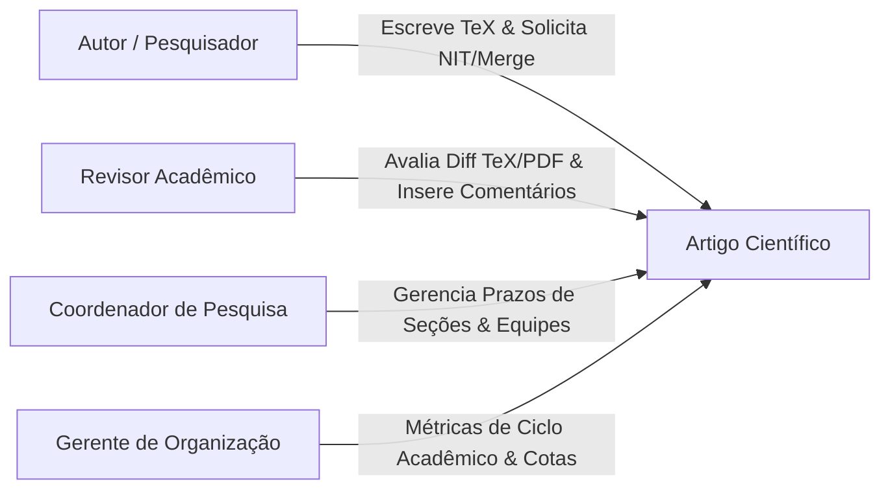
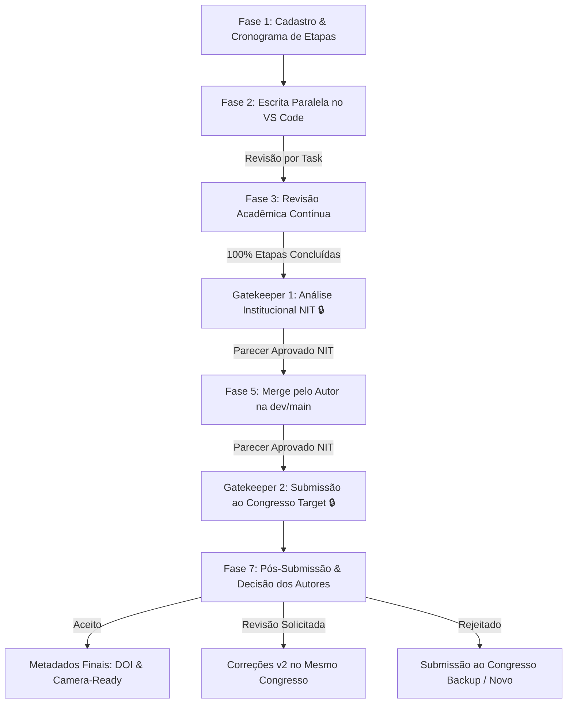
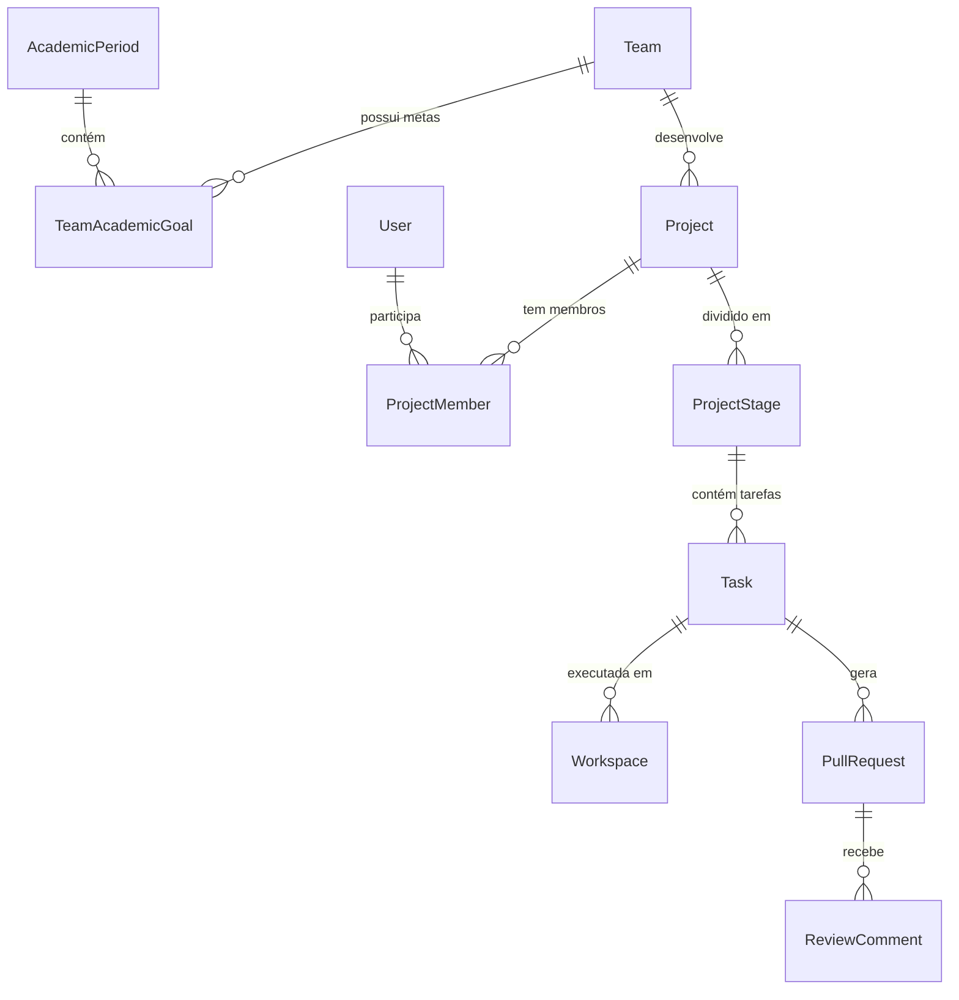

# 🚀 Roteiro & Guia Arquitetural do Sistema SCIA
## Scientific Collaboration + AI (Plataforma Web Self-Hosted)

> **Documento Técnico de Apresentação e Referência de Arquitetura**  
> **Destinatários:** Desenvolvedores, Especialistas de Infraestrutura/DevOps, Coordenadores de Pesquisa e Gerentes.  
> **Versão:** 2.0 (Consolidada com ADRs 001 a 005)

---

## 📋 Sumário
1. [Visão Geral & O Problema que Resolvemos](#1-visão-geral--o-problema-que-resolvemos)
2. [Personas do Sistema & Atribuições](#2-personas-do-sistema--atribuições)
3. [O Ciclo de Vida do Artigo em 7 Fases & Gatekeepers](#3-o-ciclo-de-vida-do-artigo-em-7-fases--gatekeepers)
4. [Visão Geral da Arquitetura de Infraestrutura (Macrovisão)](#4-visão-geral-da-arquitetura-de-infraestrutura-macrovisão)
5. [Decisões Arquiteturais Detalhadas (ADRs 001 a 005)](#5-decisões-arquiteturais-detalhadas-adrs-001-a-005)
   - [ADR 001: Autenticação OWASP & Token de Serviço GitHub](#adr-001-autenticação-owasp--token-de-serviço-github)
   - [ADR 002: Orquestração de Pods K8s On-Demand & Warm Pool](#adr-002-orquestração-de-pods-k8s-on-demand--warm-pool)
   - [ADR 003: Controle de Versão Git por Tarefa & Branches Paraleas](#adr-003-controle-de-versão-git-por-tarefa--branches-paraleas)
   - [ADR 004: Controle de Presença Redis TTL, Heartbeat Web Worker & Sweeper](#adr-004-controle-de-presença-redis-ttl-heartbeat-web-worker--sweeper)
   - [ADR 005: Estratégia de Armazenamento de Produção & Persistência PVC](#adr-005-estratégia-de-armazenamento-de-produção--persistência-pvc)
6. [Engenharia do Backend & Proxy Seguro de Edição](#6-engenharia-do-backend--proxy-seguro-de-edição)
7. [Engenharia do Frontend & Experiência de Usuário](#7-engenharia-do-frontend--experiência-de-usuário)
8. [Modelo de Dados & Projeções de Alta Performance](#8-modelo-de-dados--projeções-de-alta-performance)
9. [Roteiro Prático de Apresentação ao Vivo (Por Público-Alvo)](#9-roteiro-prático-de-apresentação-ao-vivo-por-público-alvo)

---

## 1. Visão Geral & O Problema que Resolvemos

### O Problema do Modelo Atual (Overleaf Gratuito / Community Edition vs. Instalação Local)
Atualmente, o processo de escrita acadêmica em LaTeX é dominado pelo **Overleaf** — principalmente em sua **versão gratuita em nuvem** ou na **versão Self-Hosted gratuita (Community Edition)**. Embora o Overleaf elimine a necessidade de instalação local do TeX Live, ele cria graves limitações técnicas e de governança para instituições de pesquisa:

* **Centralização e Versionamento Fragilizados:** Na versão gratuita do Overleaf, não há integração nativa e automatizada com o **GitHub** da instituição. Os artigos ficam dispersos em contas pessoais dos alunos ou em ZIPs baixados, criando risco de perda do artefato científico.
* **Ausência de Inteligência Artificial Especializada:** O Overleaf tradicional não possui assistência de IA integrada para ajudar o autor na definição de temas, busca de trabalhos correlatos, verificação de fatos/referências contra o texto e geração semântica de commits.
* **Falta de Governança Institucional e Trava do NIT:** Não existe controle de workflow de aprovação formal, nem impede que um autor submeta um artigo a uma conferência sem o aval do **NIT (Núcleo de Inovação Tecnológica)**.
* **Sem Análise Preditiva para a Coordenação:** O Overleaf não avisa os coordenadores sobre gargalos que vão estourar prazos no futuro.
* **Falta de Suporte a Extensões & IntelliSense Avançado:** O editor web do Overleaf é um ambiente fechado, diferente da riqueza de extensões, temas e IntelliSense do **VS Code nativo**.

### A Solução SCIA: "O Overleaf Privado com IA, VS Code Nativo & Governança no GitHub"
O **SCIA (Scientific Collaboration + AI)** redefiniu a escrita científica ao integrar um ambiente web **100% Self-Hosted** orquestrado em **Kubernetes (KinD)** com quatro pilares inovadores:

1. **Centralização e Custódia Segura no GitHub:** Cada artigo é provisionado automaticamente em um repositório privado no **GitHub da instituição** via Conta de Serviço. O repositório é a *fonte única da verdade* (single source of truth), versionado e seguro contra perda de dados.
2. **Ambiente VS Code Nativo (`code-server`) + IntelliSense TeX:** Poder do VS Code completo no navegador com a extensão TeX Workshop pré-configurada (auto-completion, atalhos, autocompilação de PDF no salvamento).
3. **Assistência de Inteligência Artificial Integrada (Scientific AI):**
   - **Para o Autor:** Ajuda na definição de temas de pesquisa, busca de trabalhos correlatos, revisão textual com checagem de fatos/referências (*fact-checking*) e geração automática de **commits semânticos e assertivos** refletindo o que foi realmente modificado no código TeX.
   - **Para a Coordenação:** **Análise Preditiva de Gargalos**, identificando antecipadamente fatores de risco que podem provocar atrasos na entrega de seções antes que o prazo do congresso expire.
4. **Governança Institucional Absoluta:** Painel por **Período Acadêmico**, cotas por time e a trava estrita do **Gatekeeper do NIT**, garantindo que nenhum trabalho seja submetido externamente sem o parecer formal de propriedade intelectual.

```
┌────────────────────────────────────────────────────────────────────────────────────────┐
│                                   PLATAFORMA SCIA                                      │
├──────────────────────────┬─────────────────────────────┬───────────────────────────────┤
│ Editor VS Code + TeX AI  │   Governança NIT & Prazos   │    Kubernetes KinD & Git     │
│ IntelliSense + Fact-Check│  Gatekeepers & Análise      │  Centralização no GitHub      │
│ Commits Semânticos com IA│  Preditiva de Atrasos com IA │  Pods On-Demand + Service Token│
└──────────────────────────┴─────────────────────────────┴───────────────────────────────┘
```

---

## 2. Personas do Sistema & Atribuições

O SCIA divide as responsabilidades em 4 papéis claros com permissões granulares baseadas em RBAC (*Role-Based Access Control*):



| Persona | Atribuições & Responsabilidades Principais |
| :--- | :--- |
| **Autor (`AUTHOR`)** | Cria o artigo, define o cronograma de etapas paralelas (`ProjectStage`), escreve o código TeX no VS Code embutido, efetua commits silenciosos, submete tarefas para revisão, solicita parecer do NIT e executa a submissão/merge final. |
| **Revisor (`REVIEWER`)** | Acessa o workspace em modo de leitura/revisão isolada, insere comentários linha a linha no diff TeX/PDF, aprova os Pull Requests das tarefas e registra o parecer institucional. |
| **Coordenador (`COORDINATOR`)** | Gerencia equipes de pesquisa (`Team`), ajusta prazos das etapas dos artigos, resolve gargalos de entregas e autoriza mudanças de congressos. |
| **Gerente (`MANAGER`)** | Visão executiva por **Período Acadêmico** (ex: *Ciclo 2026/2027*), define metas de submissão por time (`TeamAcademicGoal`), acompanha indicadores de over-achievement e taxa de aceitação em conferências. |

---

## 3. O Ciclo de Vida do Artigo em 7 Fases & Gatekeepers

O artigo científico transita por um fluxo finito de 7 fases com duas travas estritas de segurança (**Gatekeepers**):



### Detalhamento das Fases:
1. **Fase 1 (Cadastro & Cronograma):** Associação ao Ciclo Acadêmico ativo, escolha dos congressos *Target* e *Backups*, e criação das etapas preliminares (`ProjectStage`).
2. **Fase 2 (Escrita Paralela & Commits):** Edição no VS Code (`code-server`) em branch dedicada (`task/SLV-X-...`), com auto-compilação em PDF no salvamento e commits transparentes acionados pela plataforma.
3. **Fase 3 (Revisão Acadêmica Contínua):** Abertura de Draft PR para cada tarefa, visualização side-by-side do diff LaTeX pelo Revisor e inclusão de apontamentos por linha (`ReviewComment`).
4. **Fase 4 (Gatekeeper 1: Análise do NIT 🔒):** Trava sequencial do sistema. Só pode ser solicitada quando 100% das etapas de escrita de conteúdo estiverem concluídas.
5. **Fase 5 (Merge pelo Autor):** O Autor realiza a mesclagem da branch de trabalho após as aprovações do Revisor e do NIT. Ao mesclar, o Pod e o PVC do Kubernetes são desalocados automaticamente.
6. **Fase 6 (Gatekeeper 2: Submissão ao Congresso Target 🔒):** Trava estrita de submissão externa. Envio oficial do artigo compilado para a conferência selecionada após aprovação formal do NIT (`APPROVED_NIT`).
7. **Fase 7 (Pós-Submissão & Decisão):** Registro do resultado oficial (*Aceito*, *Revisão Solicitada*, *Rejeitado*). Se rejeitado, o sistema redireciona o artigo para o congresso backup configurado sem perder o histórico.

---

## 4. Visão Geral da Arquitetura de Infraestrutura (Macrovisão)

O ecossistema é composto por microsserviços e contêineres orquestrados em arquitetura **Self-Hosted**:

```
 ┌────────────────────────────────────────────────────────────────────────────────┐
 │                                NAVEGADOR CLIENTE                               │
 │   React 18 + Vite + TypeScript (SPA) | Web Worker (20s Heartbeat) | SSE Receiver │
 └───────────────────────────────────────┬────────────────────────────────────────┘
                                         │  HTTP / REST / SSE
                                         v
 ┌────────────────────────────────────────────────────────────────────────────────┐
 │                             FASTIFY BACKEND API & PROXY                        │
 │  - Auth JWT (HTTP-Only Cookie)  - Proxy Reverso Proxying code-server           │
 │  - eventsManager (SSE)          - k8sPodManagerService (Orquestrador K8s)    │
 └──────┬────────────────────────────────┬───────────────────────────────┬────────┘
        │                                │                               │
        │ Prisma ORM                     │ ioredis                       │ REST API
        v                                v                               v
 ┌──────────────┐                 ┌──────────────┐                ┌──────────────┐
 │  PostgreSQL  │                 │   Redis 7    │                │  GitHub API  │
 │ Data & Audit │                 │ TTL & Locks  │                │ Service Token│
 └──────────────┘                 └──────────────┘                └──────────────┘
                                         │
                                         │ Sweeper Check / Pod Lifecycle
                                         v
                          ┌──────────────────────────────┐
                          │   KUBERNETES CLUSTER (KinD)  │
                          │ - Warm Pool de Pods Reserva  │
                          │ - Pods Ativos code-server    │
                          └──────────────────────────────┘
```

---

## 5. Decisões Arquiteturais Detalhadas (ADRs 001 a 005)

### ADR 001: Autenticação OWASP & Token de Serviço GitHub
* **Problema:** Exigir que pesquisadores criem chaves SSH ou PATs (Personal Access Tokens) no GitHub inviabilizava o uso por usuários não técnicos.
* **Decisão:**
  - O backend utiliza uma **Conta de Serviço centralizada (`GITHUB_TOKEN`)** para criar repositórios privados via REST API do GitHub.
  - A autenticação do usuário com o SCIA ocorre via e-mail e senha, gerando um cookie seguro **HTTP-Only `accessToken` (JWT)**.
  - Os commits realizados no VS Code são assinados no Git usando a identidade real do usuário logado (`--author="Nome <email>"`), garantindo auditabilidade 100% no histórico do Git e no `AuditLog` do PostgreSQL, sem expor chaves sensíveis ao navegador.

### ADR 002: Orquestração de Pods K8s On-Demand & Warm Pool
* **Problema:** Criar um container Docker/Pod do zero quando o usuário clica em "Abrir Editor" causava uma espera de 15 a 30 segundos (pull de imagem TeX Live + boot do VS Code).
* **Decisão:**
  - Implementação de um **Warm Pool (Piscina de Pods Aquecidos)** no Kubernetes (`KinD`).
  - O sistema mantém Pods reserva pré-inicializados e prontos. Ao solicitar a abertura de uma tarefa, o backend vincula instantaneamente o volume/repositório Git a um Pod aquecido em **menos de 2 segundos**.
  - O Pod e seu PVC (*Persistent Volume Claim*) temporário são destruídos e limpos no Kubernetes assim que o autor faz o *Merge* da tarefa na branch principal.

### ADR 003: Controle de Versão Git por Tarefa & Branches Paralelas
* **Problema:** Conflitos de edição simultânea em arquivos TeX quando múltiplos autores alteram o mesmo projeto.
* **Decisão:**
  - O sistema associa cada `Task` a uma branch isolada (`task/SLV-X-<slug>`), ramificada a partir da branch da etapa pai (`feature/<stage-slug>`).
  - O editor `code-server` é aberto diretamente na branch da tarefa solicitada.
  - Isso garante edição paralela sem riscos de colisão até a etapa de revisão e merge formal.

### ADR 004: Controle de Presença Redis TTL, Heartbeat Web Worker & Sweeper
* **Problema:** Acúmulo e vazamento de Pods Kubernetes no cluster (Pods "Zumbis") quando usuários fechavam o navegador sem clicar em "Sair", além do encerramento indevido de Pods quando navegadores suspendiam timers em abas em segundo plano.
* **Decisão:**
  - **Redis 7 Alpine (`sci_latex_redis`):** Armazena o registro de presença atômica distribuída com chave `workspace:active:<mode>:<projectId>:<userId>:<taskId>` e **TTL de 180 segundos (3 minutos)** (`SETEX`).
  - **Web Worker Heartbeat no Frontend:** O hook `useSSEEventSource` roda um timer de **20 segundos dentro de um Blob Web Worker inline**. Workers rodam em threads isoladas e são **imunes ao throttling/suspensão de timers** impostos pelos navegadores em abas sem foco.
  - **Listener de `visibilitychange`:** Força heartbeat síncrono imediato assim que a aba recupera o foco.
  - **Sweeper / Garbage Collector de Pods:** A cada 60s (e no boot do Fastify), a rotina `K8sPodManagerService.reconcileOrphanPods()` varre o Kubernetes. Se um Pod não possuir chave ativa no Redis, ele é destruído imediatamente.
  - **Task Occupied Lock:** O Redis atua como trava de exclusividade. Se a chave de presença existir para o Usuário A, a abertura da mesma tarefa pelo Usuário B é rejeitada com **HTTP 409 Conflict (`TASK_WORKSPACE_OCCUPIED`)**.

### ADR 005: Estratégia de Armazenamento de Produção & Persistência PVC
* **Problema:** Garantir performance I/O rápida para compilações TeX no VS Code sem perder o trabalho em caso de crash do container.
* **Decisão:**
  - Utilização de volumes locais de alta velocidade acoplados aos PVCs do Kubernetes para o diretório de trabalho do VS Code.
  - Commits silenciosos automáticos persistem o estado no repositório GitHub remoto periodicamente, tornando o armazenamento local descartável e altamente resiliente.

---

## 6. Engenharia do Backend & Proxy Seguro de Edição

O backend é construído em **Node.js + Fastify + TypeScript**, estruturado em módulos independentes:

```
backend/src/
├── config/             # Variáveis de ambiente (Zod env validation)
├── infra/
│   ├── k8s/            # K8sPodManagerService (@kubernetes/client-node)
│   ├── redis/          # RedisService (ioredis client, TTL & locks)
│   └── watcher/        # WorkspaceWatcherService (chokidar file watching)
├── modules/
│   ├── auth/           # Autenticação JWT e Cookies HTTP-Only
│   ├── editor-proxy/   # EditorProxyService (Proxy HTTP/WS para o code-server)
│   ├── events/         # EventsManagerService (Server-Sent Events - SSE)
│   ├── projects/       # Gestão de Artigos e Estágios
│   ├── tasks/          # Tarefas, Presença e Git Checkout
│   └── reviews/        # Comentários por linha e Parecer NIT
└── repositories/       # Abstração de Banco de Dados com Prisma ORM
```

### O Proxy Reverso do Editor (`EditorProxyService`)
O navegador não acessa o `code-server` diretamente. Toda a comunicação de visualização, arquivos e websockets passa pelo Fastify:
1. Valida o cookie JWT da requisição.
2. Verifica se o usuário pertence ao projeto no PostgreSQL.
3. Roteia o tráfego de forma transparente para o IP do Pod Kubernetes correspondente, mantendo o isolamento de rede e impedindo acessos não autorizados ao editor.

---

## 7. Engenharia do Frontend & Experiência de Usuário

O frontend é construído com **React 18 + Vite + TypeScript**, seguindo o **SCIA Design System** (Glassmorphism, modo escuro nativo e variáveis HSL customizadas).

### Componentes Principais:
1. **Zen Mode Editor (`code-server` em `<iframe>`):** Interface focada, sem distrações ou extensões externas. O arquivo `settings.json` é injetado pelo container com auto-build de PDF no salvamento (`"latex-workshop.latex.autoBuild.run": "onSave"`).
2. **Visão de Gantt / Timeline de Estágios:** Visualização gráfica interativa para gerenciamento das etapas paralelas do artigo (`GanttTimelineView.tsx`).
3. **Módulo de Revisão Side-by-Side (`ReviewDetailPage.tsx`):** Exibe o diff do código TeX lado a lado com o preview compilado em PDF.
4. **Drawer de Comentários por Linha:** Permite ao Revisor marcar linhas específicas do arquivo TeX e cadastrar observações pendentes ou resolvidas.
5. **Sincronização em Tempo Real via SSE:** TanStack Query acoplado ao Server-Sent Events atualiza os estados da interface instantaneamente sem necessidade de recarregar a página (F5).

---

## 8. Modelo de Dados & Projeções de Alta Performance

O modelo de dados é gerenciado via **Prisma ORM** sobre **PostgreSQL**:



### Projeções Locais no PostgreSQL
Para evitar gargalos e *rate limits* na API do GitHub durante o carregamento de dashboards executivos, o sistema mantém tabelas de projeção sincronizadas (`GithubIssueProjection`, `GithubProjectItemProjection`). As telas de métricas consultam o PostgreSQL diretamente com respostas em milissegundos.

---

## 9. Roteiro Prático de Apresentação ao Vivo (Por Público-Alvo)

Ao apresentar a aplicação para diferentes perfis, utilize o roteiro abaixo para enfatizar os pontos de maior valor:

### 🎯 Para Coordenadores e Gestores Acadêmicos
1. **Foco:** Governança, prazos e controle institucional.
2. **Demonstração:**
   - Mostre o **Dashboard de Período Acadêmico** e como as cotas de artigos são acompanhadas.
   - Mostre a **Timeline de Etapas (Gantt)** e como o descumprimento de prazos acende alertas visuais.
   - Apresente o **Gatekeeper do NIT**: explique que nenhum artigo é submetido a uma conferência externa sem a trava formal de aprovação da instituição.

### 💻 Para Desenvolvedores e Especialistas em Infra/DevOps
1. **Foco:** Arquitetura, Kubernetes KinD, Redis TTL e Automação Git.
2. **Demonstração:**
   - Explique a **Warm Pool de Pods**: mostre como o VS Code abre instantaneamente via Pods pré-aquecidos.
   - Destaque a **ADR 004 (Redis + Web Worker)**: explique como o Redis com TTL de 180s e o Web Worker a cada 20s resolvem o problema de vazamento de Pods no Kubernetes sem matar conexões em abas em segundo plano.
   - Destaque o **Proxy Reverso do Fastify**: mostre que o usuário navega com segurança via Cookie HTTP-Only e Token de Serviço Git, sem lidar com chaves SSH.

### ✍️ Para Pesquisadores e Revisores (Usuários Finais)
1. **Foco:** Facilidade de uso, zero instalação e revisão integrada.
2. **Demonstração:**
   - Abra o **Editor VS Code embutido**: altere um texto TeX e mostre o PDF compilando automaticamente no salvamento.
   - Mostre a **Tela de Revisão Side-by-Side**: selecione uma linha do código e adicione um comentário no Drawer.
