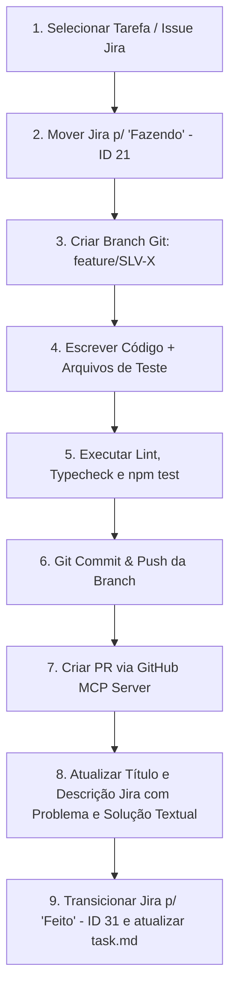

# Workflow de Desenvolvimento & Integração Git/Jira/GitHub (`WORKFLOW_SKILL.md`)

Este documento estabelece o fluxo de trabalho obrigatório para criação de branches, testes automatizados, verificação de qualidade, integração com Jira e abertura de Pull Requests via GitHub MCP Server no projeto **sci-latex-vscode**.

---

## 1. Regras Fundamentais de Qualidade & Nomenclatura

> [!IMPORTANT]
> 1. **Código em Inglês, Comentários em Português:** Nomes de variáveis, funções, classes, arquivos, enums, rotas e tabelas 100% em Inglês. Comentários explicativos podem ser em Português.
> 2. **Testes Automatizados Obrigatórios:** Toda implementação backend/frontend que possua lógica de negócio ou rotas de API deve conter seus respectivos arquivos de testes unitários ou de integração (`*.test.ts` / `*.spec.ts`).
> 3. **Fluxo de Branch por Feature:** Cada nova atividade deve ser desenvolvida em sua própria branch Git (`feature/SLV-X-nome-da-task`). Nenhuma alteração direta é feita na `main`.
> 4. **Gestão de Tarefas no Jira (Fazendo -> Título & Descrição Textual -> Feito):** Ao assumir/iniciar qualquer task do Jira, transicione-a imediatamente para **`Fazendo`** (In Progress, ID 21). Ao implementar ou concluir, aprimore o **Título (Summary)** e a **Descrição (Description)** da issue no Jira com uma explicação textual detalhada contemplando **Problema** e **Solução** (estritamente em texto descritivo, **sem incluir trechos de código**). Ao finalizar, transicione a issue para **`Feito`** (Done, ID 31).

---

## 2. Diagrama do Ciclo de Vida de uma Tarefa



---

## 3. Passo a Passo Detalhado para Cada Feature

### Passo 1: Início no Jira & Branch Git
1. Ao pegar uma task no Jira (ex: `SLV-X`), mover a issue para **`Fazendo`** (`transitionJiraIssue` com ID `21`).
2. Criar e trocar para a nova branch de feature:
   ```bash
   git checkout -b feature/SLV-X-nome-da-feature
   ```
3. Atualizar o item no `task.md` como em andamento `[/]`.

### Passo 2: Implementação & Criar Arquivos de Teste
1. Escrever o código da funcionalidade mantendo todos os identificadores em Inglês.
2. **Criar os testes automatizados:**
   * Backend: Arquivos `*.test.ts` em `src/modules/<modulo>/__tests__/` ou ao lado dos arquivos.
   * Frontend: Arquivos `*.test.tsx` com React Testing Library / Vitest.

### Passo 3: Verificação de Qualidade (Lint, Typecheck & Testes)
1. Rodar a verificação de tipos: `npx tsc --noEmit` (ou `npm run lint`).
2. Rodar a suíte de testes: `npm test`.
3. **Regra:** Não avançar se houver falhas em testes ou erros de compilação.

### Passo 4: Commit, Push & Pull Request via GitHub MCP
1. Commit das alterações:
   ```bash
   git add .
   git commit -m "feat(scope): SLV-X descrição clara do que foi feito"
   ```
2. Push para o repositório remoto:
   ```bash
   git push -u origin feature/SLV-X-nome-da-feature
   ```
3. Abertura do Pull Request via **GitHub MCP Server**:
   * Usar a ferramenta `create_pull_request` (ou equivalente no GitHub MCP).
   * **Title:** `[SLV-X] Nome da Feature`
   * **Base:** `main`
   * **Head:** `feature/SLV-X-nome-da-feature`

### Passo 5: Atualização de Título e Descrição no Jira & Conclusão
1. **Melhorar o Título e a Descrição no Jira:** Atualizar a issue (`editJiraIssue`) refinando o Título (*summary*) e preenchendo detalhadamente a Descrição (*description*) contemplando **Problema** e **Solução** de forma estritamente textual (sem blocos de código).
2. Mover o status da issue no Jira para **`Feito`** (`transitionJiraIssue` com ID `31`).
3. Atualizar o item no `task.md` para concluído `[x]`.

---

## 4. Parâmetros de Integração com os MCP Servers

### Jira (Atlassian MCP Server)
* **Cloud ID:** `digitalanalyticsapps.atlassian.net` (ou UUID `9b8a01c9-a829-4f00-8e5a-42a80e690907`)
* **Project Key:** `SLV`
* **Transição Fazendo:** `21` | **Transição Feito:** `31`

### GitHub (GitHub MCP Server & Octokit SDK)
* **Owner:** `Digital-Analytics-Apps`
* **Repo:** `sci-latex-vscode-ai`
* **SDK Oficial:** Utilizar `@octokit/rest` para todas as chamadas de API (criação/gestão de PRs, reviews, repositórios).
* **Autenticação Segura Git CLI:** Para comandos `git` via terminal, não embutir tokens em URLs. Utilizar a flag efêmera em memória `-c http.extraHeader="Authorization: Basic <base64>"`.

