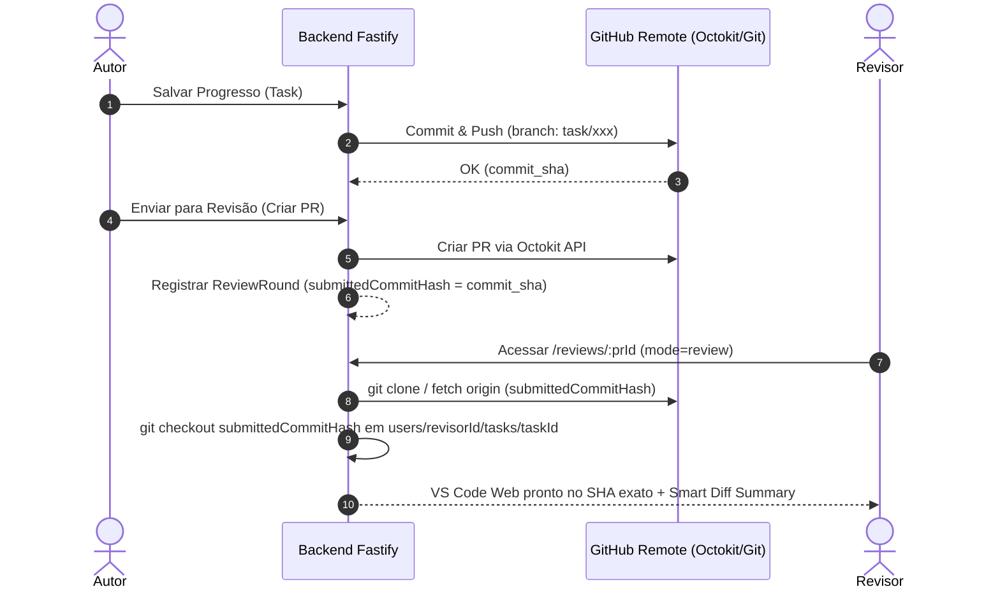

# Especificação Técnica: GitService, Provisionamento GitHub-Native & Visão do Revisor

**Status**: Especificação Oficial Aprovada  
**Data da Última Atualização**: 2026-09-24  
**Componentes**: `backend/src/infra/git/git.service.ts` & `backend/src/modules/editor-proxy/editor-proxy.service.ts`

---

## 1. Princípios Arquiteturais & Divisão de Ferramentas

O SCI-LaTeX adota o **GitHub como Única Fonte da Verdade (Single Source of Truth)**. A gestão de versão, branches, commits e revisões pertence ao domínio da infraestrutura Git/GitHub.

### Divisão Estrita de Ferramentas:

1. **Octokit REST API SDK (`@octokit/rest`)**:
   - **Módulo**: Operações administrativas e de domínio da plataforma GitHub.
   - **Responsabilidades**:
     - Criação e configuração de repositórios remotos na conta/organização do GitHub (`createForAuthenticatedUser` / `createInOrg`).
     - Gestão do ciclo de vida de Pull Requests (criação de rascunhos, listagem, vinculação de pareceres e merge).
     - Obtenção do estado mais recente dos commits (`submittedCommitHash`) para rodadas de revisão (`ReviewRound`).

2. **Git CLI Nativo (`git`)**:
   - **Módulo**: Operações de árvore de trabalho (Working Tree) nos Pods/workspaces locais do servidor.
   - **Responsabilidades**:
     - `git clone`: Clona repositórios diretamente da URL HTTPS remota do GitHub usando `GITHUB_TOKEN`.
     - `git fetch`: Baixa commits e refs das branches diretamente do remoto do GitHub.
     - `git checkout`: Posiciona a árvore de trabalho na branch ou no SHA do commit imutável da submissão (`submittedCommitHash`).
     - `git commit` & `git push`: Registra e envia atualizações de progresso do Autor diretamente para a branch correspondente no GitHub.

---

## 2. Invariantes do Provisionamento de Workspaces

1. **Zero Arquivos Estáticos Locais (`fs.cp`)**:
   - É proibido criar workspaces efetuando cópia manual de pastas de arquivos (`fs.cp`) do servidor.
   - Todo workspace (seja do Autor ou do Revisor) nasce exclusivamente a partir de um `git clone` ou `git fetch` direto da URL do GitHub.

2. **Isolamento de Workspaces por Usuário e Papel**:
   - **Autor**: Opera em `projects/${projectId}/users/${authorUserId}/tasks/${taskId}`. O backend garante clone/checkout da branch ativa da tarefa (ex: `task/123-introducao`).
   - **Revisor**: Opera em `projects/${projectId}/users/${reviewerUserId}/tasks/${taskId}`. O backend garante clone/checkout posicionado diretamente no SHA imutável da submissão (`submittedCommitHash`) daquele PR no GitHub.

3. **Garantia de Checkout Imutável no Modo Revisão (`mode=review`)**:
   - Ao acessar a rota `/reviews/:prId`, o backend recupera a `headBranch` e o `submittedCommitHash` da rodada de revisão.
   - O workspace do Revisor sincroniza via GitHub e executa `git checkout ${submittedCommitHash}` (ou `git reset --hard ${submittedCommitHash}`).
   - **Efeito**: O Revisor enxerga a fotografia lógica congelada da submissão do Autor, insensível a rascunhos posteriores que o Autor possa estar fazendo.

4. **Autenticação Transparente com Cabeçalho HTTP Efêmero**:
   - Chamadas de linha de comando `git` usam o cabeçalho efêmero `http.extraHeader="Authorization: Basic ..."` configurado pelo `GitService.getGitAuthFlags()`, sem embutir senhas ou tokens em strings de caminho remoto.

---

## 3. Fluxo de Trabalho Integrado (Autor & Revisor)

