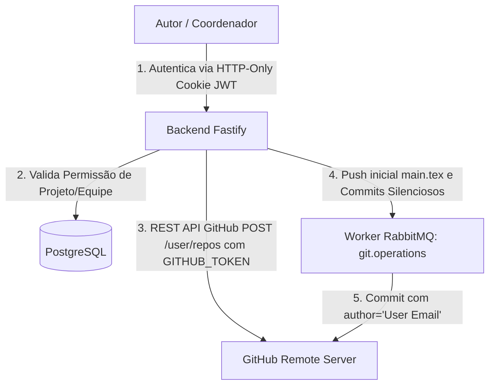

# Especificação Técnica e Arquitetural (Specs)

**Projeto:** Plataforma Web de Escrita Científica Self-Hosted  
**Última Atualização:** 2026-09-05  
**Status:** Especificação Completa (Modelo de Compilação Duplo, Provisionamento Git, Token de Serviço, Stream SSE)  

---

## 1. Visão Geral e Objetivos

Este documento contém as especificações técnicas, padrões de código, modelo de dados e decisões de arquitetura para a plataforma de escrita científica. Ele garante a consistência técnica durante todas as fases do desenvolvimento.

> [!IMPORTANT]
> **Padrão de Código em Inglês:**  
> Todos os identificadores de código (modelos, enums, interfaces, variáveis, funções, rotas, props, classes) devem ser escritos estritamente em **Inglês**. Comentários e documentações explicativas podem ser em **Português**.

---

## 2. Arquitetura do Modelo Duplo de Compilação LaTeX

Para garantir performance imediata ao Autor e reprodutibilidade ao Revisor/Coordenador, o sistema adota um **Modelo Duplo de Compilação**:

```mermaid
graph TD
    subgraph "1. Compilação de Edição (Interativa / Autor)"
        Author[Autor no VS Code Iframe] -->|Ctrl+S / Auto-build| Extension[Extensão LaTeX Workshop]
        Extension -->|Local TeX Live| LocalPDF[PDF Preview na aba do VS Code]
    end

    subgraph "2. Compilação Oficial do Servidor (Revisão & Release)"
        PR[Abertura de PR / Solicitado pelo Revisor] -->|Dispara Job| WorkerTeX[Worker RabbitMQ: latex.compilation]
        WorkerTeX -->|Docker Isolated Container TeX Live| ServerPDF[PDF Oficial do PR / Artigo Consolidado]
        ServerPDF -->|Exibe no React PDF Viewer| Reviewer[Tela do Revisor / Coordenador]
    end
```



### 2.1 Por que temos duas formas de compilação?
1. **No VS Code do Autor (Interativo):** O container do `code-server` de cada usuário já possui o TeX Live e a extensão `LaTeX Workshop` instalada, gerando o PDF em tempo real na aba do editor enquanto ele escreve.
2. **No Servidor Backend (Background Queue):** A compilação via fila `latex.compilation` é executada para:
   * Gerar o PDF oficial que é exibido no **PDF Viewer da tela do Revisor** (para que o Revisor avalie o PR sem precisar entrar na máquina/workspace do autor).
### 2.2 Gestão de Classes e Templates LaTeX (`.cls` / `.sty`) & Evolução Futura

* **Suporte Nativo a Editores Acadêmicos:** A plataforma suporta múltiplos templates de congressos e periódicos acadêmicos (IEEE via `IEEEtran.cls`, ACM via `acmart.cls`, SBC via `sbc-template.sty` e Springer LNCS via `llncs.cls`).
* **Auto-provisionamento na Workspace:** Ao criar um artigo, a plataforma grava o arquivo de classe correspondente no próprio repositório do artigo (`./storage/projects/<projectId>/<template>.cls`), garantindo compilação autônoma instantânea no `code-server` e no worker de background.
* **> [!NOTE] Nota de Evolução Futura (Backlog Arquitetural):**  
  Em versões futuras, o sistema poderá expandir a gestão de templates para permitir que o usuário (ou Coordenador/Gerente) envie arquivos de classe customizados (`.cls`/`.sty` ou pacote `.zip`) para cadastro no catálogo dinâmico de templates da organização ou upload direto na workspace.

---

## 3. Arquitetura de Provisionamento Git Remoto no GitHub & Controle de Acesso (Service Token)

### 3.1 Como Funciona o Acesso e Criação Obrigatória no GitHub

O usuário **NÃO** precisa gerenciar chaves SSH ou tokens individuais de Git manualmente. A autenticação do usuário com a plataforma é realizada por **Cookies HTTP-Only (`accessToken`)** e **JWT (JSON Web Token)** (em estrita conformidade com os padrões OWASP, sem exposição em query parameters de URL).

* **Provisionamento Automático Remoto:** O backend Fastify utiliza o **Token de Serviço do GitHub (`GITHUB_TOKEN`)** para criar obrigatoriamente um repositório remoto privado via REST API do GitHub (`POST /user/repos` ou `/orgs/{org}/repos`).
* **Padrão de Nomeação Amigável (Slug + Short Hash):** Os repositórios no GitHub são nomeados com o slug do título limpo e um sufixo curto de 8 caracteres do UUID para garantir 100% de unicidade e identificação clara na interface do GitHub (ex: `sci-paper-otimizacao-de-compiladores-tex-isolados-5550a24e`).
* **Registro de Progresso Silencioso (`POST /api/v1/projects/:id/sections/:sectionId/commit`):** O salvamento de progresso pelo Autor gera um commit silencioso assinado pela Conta de Serviço em nome do autor (`--author="Nome <email>"`) e um registro auditável no `AuditLog`.



### 3.2 Estratégia de Branches Git (main, dev e feature/section) e Proteções

Para garantir isolamento, rastreabilidade e integridade no código TeX do artigo, a plataforma segue uma convenção estrita de branches:

1. **`main` (Production / Camera-Ready)**:
   - Contém a versão oficial consolidada do artigo pronto para submissão final.
   - **Bloqueio Estrito**: Não recebe commits diretos. Apenas recebe merges da branch `dev` após aprovação do artigo e **parecer favorável do NIT (Núcleo de Inovação Tecnológica)** na penúltima etapa antes da submissão.
   - **Proteção Total**: Nunca pode ser excluída.

2. **`dev` (Development / Integration)**:
   - É a branch base de integração constante do projeto e o **target padrão de todos os Pull Requests de seções**.
   - **Bloqueio Estrito**: Não recebe commits diretos. Recebe merges dos PRs de seções aprovados **exclusivamente pelo Revisor** (sem exigir validação do NIT nesta etapa).
   - **Proteção Total**: Nunca pode ser excluída.

3. **Branch da Seção do Autor (`feature/<slug>-<shortHash>` ou `section/<slug>-<shortHash>`)**:
   - Branch de trabalho individual atribuída à seção e ao autor.
   - **Identificador Único (Short Hash)**: Cada branch possui um sufixo hash único de 8 caracteres (ex: `section/introduction-a1b2c3d4` ou `feature/sec-1-5550a24e`) para evitar colisões entre colaboradores ou tentativas paralelas.
   - O autor executa os commits do "Salvar Progresso" nesta branch.
   - **Exclusão Pós-Merge**: Após o Pull Request ser aprovado pelo Revisor e o merge ser executado na `dev`, a branch da seção é **automaticamente removida** do repositório remoto no GitHub (`git push origin --delete <branchName>`) para manter o repositório limpo.

---

## 4. Stack Tecnológica Oficial

| Camada | Tecnologia Escolhida | Racional Técnico |
| :--- | :--- | :--- |
| **Frontend** | ReactJS + TypeScript | Tipagem estrita, performance de renderização e rico ecossistema de UI. |
| **Gerenciamento de Estado** | Redux Toolkit (UI) + TanStack Query (API) | Separação clara entre estado de interface/iframe e cache de requisições. |
| **Comunicação Real-Time** | Server-Sent Events (SSE) | Stream HTTP unidirecional leve (`EventSource`) para notificações sem overhead. |
| **Backend Framework** | Fastify (Node.js + TypeScript) | Alto desempenho de I/O, suporte a esquemas JSON (AJV) e baixo overhead. |
| **ORM & Banco de Dados** | Prisma ORM + PostgreSQL | Relacionamentos estritos, transações ACID e logs em JSONB. |
| **Mensageria & Filas** | RabbitMQ | Desacoplamento assíncrono para operações de Git, Docker TeX (PRs e Release), notificações e cron de prazos. |
| **Ambiente de Edição** | VS Code (`code-server` via Iframe) | Experiência de desenvolvimento completa para LaTeX (com extensão LaTeX Workshop e TeX Live local). |
| **Compilação TeX Oficial** | Docker + Imagem TeX Live | Compilações isoladas de PRs e artigos consolidados sem poluir o host. |

---

## 5. As 7 Fases do Ciclo de Vida do Artigo

```
[Fase 1: Cadastro & Prazos] ──> [Fase 2: Escrita & Commits] ──> [Fase 3: Revisão Acadêmica]
                                                                        │
                                                               [Fase 4: Validação NIT]
                                                                        │
[Fase 7: Pós-Submissão & Decisão dos Autores] <── [Fase 6: Submissão] <── [Fase 5: Merge pelo Autor]
    │
    ├── [Cenário A: ACEITO] ───────────> Metadados Finais (DOI, Links, Camera-Ready) ──> [CONCLUÍDO]
    │
    ├── [Cenário B: REVISÃO SOLICITADA] ──> Correções no Mesmo Congresso ─────────────> [Reenvio Mesma Conferência]
    │
    └── [Cenário C: REJEITADO] ─────────> Autores Decidem: Congresso Backup ou Novo ──> [Ajustes v2]
```

---

## 6. Especificação do Modelo de Dados (Prisma Schema Reference)

```prisma
enum Role {
  AUTHOR
  REVIEWER
  COORDINATOR
  MANAGER
  ADMIN
}

enum PRStatus {
  DRAFT
  UNDER_REVIEW
  CHANGES_REQUESTED
  APPROVED
  MERGED
  CANCELLED
}

enum NITStatus {
  NOT_REQUIRED
  WAITING_NIT
  APPROVED_NIT
  REJECTED_NIT
}

enum SubmissionStatus {
  IN_PROGRESS
  WAITING_NIT
  SUBMITTED_TARGET
  SUBMITTED_BACKUP
  ACCEPTED_REVISION_REQUESTED
  ACCEPTED_CAMERA_READY
  REJECTED_WAITING_DECISION
  REJECTED_REOPENED_V2
  COMPLETED_PUBLISHED
}

enum DeadlineStatus {
  ON_TIME
  WARNING_SOON
  OVERDUE
}

model User {
  id            String          @id @default(uuid())
  email         String          @unique
  name          String
  passwordHash  String
  role          Role            @default(AUTHOR)
  createdAt     DateTime        @default(now())
  updatedAt     DateTime        @updatedAt
  
  coordinatedTeams Team[]       @relation("TeamCoordinator")
  managedTeams     Team[]       @relation("ManagerTeams")
  teamMemberships  TeamMember[]

  projects      ProjectMember[]
  pullRequests  PullRequest[]   @relation("AuthorPRs")
  reviews       PullRequest[]   @relation("ReviewerPRs")
  comments      ReviewComment[]
  sessions      Session[]
  auditLogs     AuditLog[]
}

model AcademicPeriod {
  id        String    @id @default(uuid())
  name      String    // e.g., "Academic Cycle 2026/2027"
  startDate DateTime
  endDate   DateTime
  createdAt DateTime  @default(now())
  updatedAt DateTime  @updatedAt
  projects  Project[]
}

model Team {
  id            String       @id @default(uuid())
  name          String
  description   String?
  managerId     String?
  coordinatorId String
  manager       User?        @relation("ManagerTeams", fields: [managerId], references: [id])
  coordinator   User         @relation("TeamCoordinator", fields: [coordinatorId], references: [id])
  createdAt     DateTime     @default(now())
  updatedAt     DateTime     @updatedAt
  members       TeamMember[]
  projects      Project[]
}

model TeamMember {
  id        String   @id @default(uuid())
  teamId    String
  userId    String
  role      Role     @default(AUTHOR)
  team      Team     @relation(fields: [teamId], references: [id], onDelete: Cascade)
  user      User     @relation(fields: [userId], references: [id], onDelete: Cascade)

  @@unique([teamId, userId])
}

model Project {
  id                      String           @id @default(uuid())
  name                    String
  description             String?
  gitRepoPath             String
  teamId                  String
  academicPeriodId        String?
  
  submissionStatus        SubmissionStatus @default(IN_PROGRESS)
  currentVersion          Int              @default(1)
  
  targetConferenceName    String?
  targetConferenceDate    DateTime?
  backupConferenceName    String?
  backupConferenceDate    DateTime?
  
  doi                     String?
  publicationUrl          String?
  datasetUrl              String?
  publishedAt             DateTime?
  
  reviewerFeedback        String?
  
  team                    Team             @relation(fields: [teamId], references: [id], onDelete: Cascade)
  academicPeriod          AcademicPeriod?  @relation(fields: [academicPeriodId], references: [id])
  createdAt               DateTime         @default(now())
  updatedAt               DateTime         @updatedAt
  members                 ProjectMember[]
  sections                Section[]
  prs                     PullRequest[]
}

model ProjectMember {
  id        String   @id @default(uuid())
  userId    String
  projectId String
  role      Role
  user      User     @relation(fields: [userId], references: [id], onDelete: Cascade)
  project   Project  @relation(fields: [projectId], references: [id], onDelete: Cascade)

  @@unique([userId, projectId])
}

model Section {
  id          String        @id @default(uuid())
  title       String
  filePath    String
  branchName  String
  projectId   String
  assignedTo  String?
  
  startDate   DateTime?
  dueDate     DateTime?
  
  project     Project       @relation(fields: [projectId], references: [id], onDelete: Cascade)
  prs         PullRequest[]
}

model PullRequest {
  id          String          @id @default(uuid())
  title       String
  description String?
  status      PRStatus        @default(DRAFT)
  
  nitStatus   NITStatus       @default(NOT_REQUIRED)
  nitNotes    String?
  
  sectionId   String
  authorId    String
  reviewerId  String?
  projectId   String
  createdAt   DateTime        @default(now())
  updatedAt   DateTime        @updatedAt
  mergedAt    DateTime?
  section     Section         @relation(fields: [sectionId], references: [id], onDelete: Cascade)
  author      User            @relation("AuthorPRs", fields: [authorId], references: [id])
  reviewer    User?           @relation("ReviewerPRs", fields: [reviewerId], references: [id])
  project     Project         @relation(fields: [projectId], references: [id], onDelete: Cascade)
  comments    ReviewComment[]
}

model ReviewComment {
  id            String      @id @default(uuid())
  pullRequestId String
  userId        String
  lineNumer     Int?
  comment       String
  createdAt     DateTime    @default(now())
  pullRequest   PullRequest @relation(fields: [pullRequestId], references: [id], onDelete: Cascade)
  user          User        @relation(fields: [userId], references: [id])
}

model AuditLog {
  id         String   @id @default(uuid())
  userId     String?
  action     String
  entityType String
  entityId   String
  details    Json?
  createdAt  DateTime @default(now())
  user       User?    @relation(fields: [userId], references: [id], onDelete: SetNull)
}

model Session {
  id           String   @id @default(uuid())
  userId       String
  refreshToken String   @unique
  expiresAt    DateTime
  createdAt    DateTime @default(now())
  user         User     @relation(fields: [userId], references: [id], onDelete: Cascade)
}
```
