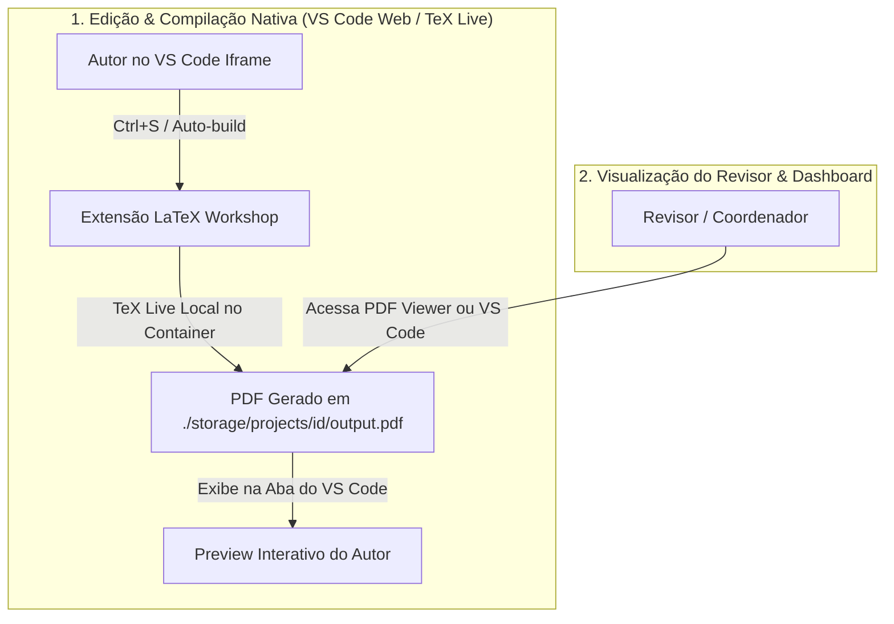
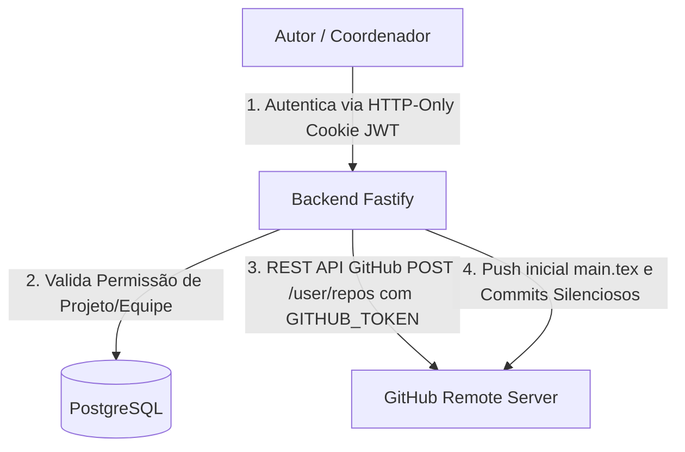

# Especificação Técnica e Arquitetural (Specs)

**Projeto:** Plataforma Web de Escrita Científica Self-Hosted  
**Última Atualização:** 2026-09-08  
**Status:** Especificação Completa (KinD Kubernetes Cluster Local, Warm Standby Pool, Pods sob Demanda, PVC por Projeto, Limpeza Inteligente de PVCs, Estrutura Modular TeX, SDK Octokit, Stream SSE)

---

## 1. Visão Geral e Objetivos

Este documento contém as especificações técnicas, padrões de código, modelo de dados e decisões de arquitetura para a plataforma de escrita científica. Ele garante a consistência técnica durante todas as fases do desenvolvimento.

> [!IMPORTANT]
> **Padrão de Código em Inglês:**  
> Todos os identificadores de código (modelos, enums, interfaces, variáveis, funções, rotas, props, classes) devem ser escritos estritamente em **Inglês**. Comentários e documentações explicativas podem ser em **Português**.

---

## 2. Arquitetura de Edição e Compilação Nativa TeX Live (VS Code Embedded)

Para garantir performance imediata ao Autor e simplicidade de infraestrutura para o servidor self-hosted (zero overhead de broker), a compilação TeX é realizada nativamente dentro do container do `code-server` pela extensão **LaTeX Workshop**:



### 2.1 Por que a compilação nativa no `code-server` elimina o RabbitMQ?

1. **Compilação Nativa Instantânea:** O container do `code-server` de cada usuário já possui o TeX Live e a extensão `LaTeX Workshop` instaladas. A compilação é acionada automaticamente ao salvar (`Ctrl+S`).
2. **Eliminação de Duplicidade:** O PDF oficial gerado na workspace pelo último autor/revisor que editou a seção já é o PDF compilado final. Não é necessário reenviar mensagens para uma fila de background do RabbitMQ recompilar o documento do zero.
3. **Servidor Leve e Econômico:** Removemos a dependência do cluster RabbitMQ/Erlang (~200MB-300MB de RAM), simplificando a infraestrutura Docker para apenas 2 containers principais (`sci_latex_backend` e `sci_latex_codeserver`).

### 2.2 Gestão de Classes e Templates LaTeX (`.cls` / `.sty`) & Evolução Futura

- **Suporte Nativo a Editores Acadêmicos:** A plataforma suporta múltiplos templates de congressos e periódicos acadêmicos (IEEE via `IEEEtran.cls`, ACM via `acmart.cls`, SBC via `sbc-template.sty` e Springer LNCS via `llncs.cls`).
- **Auto-provisionamento na Workspace:** Ao criar um artigo, a plataforma grava o arquivo de classe correspondente no próprio repositório do artigo (`./storage/projects/<projectId>/<template>.cls`), garantindo compilação autônoma instantânea no `code-server`.
- **> [!NOTE] Nota de Evolução Futura (Backlog Arquitetural):**  
  Em versões futuras, o sistema poderá expandir a gestão de templates para permitir que o usuário (or Coordenador/Gerente) envie arquivos de classe customizados (`.cls`/`.sty` ou pacote `.zip`) para cadastro no catálogo dinâmico de templates da organização ou upload direto na workspace.

---

## 3. Arquitetura de Provisionamento Git Remoto no GitHub & Controle de Acesso (Service Token)

### 3.1 Como Funciona o Acesso e Criação Obrigatória no GitHub

O usuário **NÃO** precisa gerenciar chaves SSH ou tokens individuais de Git manualmente. A autenticação do usuário com a plataforma é realizada por **Cookies HTTP-Only (`accessToken`)** e **JWT (JSON Web Token)** (em estrita conformidade com os padrões OWASP, sem exposição em query parameters de URL).

- **Provisionamento Automático Remoto:** O backend Fastify utiliza o **Token de Serviço do GitHub (`GITHUB_TOKEN`)** para criar obrigatoriamente um repositório remoto privado via REST API do GitHub (`POST /user/repos` ou `/orgs/{org}/repos`).
- **Padrão de Nomeação Amigável (Slug + Short Hash):** Os repositórios no GitHub são nomeados com o slug do título limpo e um sufixo curto de 8 caracteres do UUID para garantir 100% de unicidade e identificação clara na interface do GitHub (ex: `sci-paper-otimizacao-de-compiladores-tex-isolados-5550a24e`).
- **Registro de Progresso Silencioso (`POST /api/v1/projects/:id/tasks/:taskId/commit`):** O salvamento de progresso pelo Autor gera um commit silencioso assinado pela Conta de Serviço em nome do autor (`--author="Nome <email>"`) e um registro auditável no `AuditLog`.



### 3.2 Estratégia de Branches Git (main, dev e task/<slug>-<shortHash>) e Proteções

Para garantir isolamento, rastreabilidade e integridade no código TeX do artigo, a plataforma segue uma convenção estrita de branches:

1. **`main` (Production / Camera-Ready)**:
   - Contém a versão oficial consolidada do artigo pronto para submissão final.
   - **Bloqueio Estrito**: Não recebe commits diretos. Apenas recebe merges da branch `dev` após aprovação do artigo e **parecer favorável do NIT (Núcleo de Inovação Tecnológica)** na penúltima etapa antes da submissão.
   - **Proteção Total**: Nunca pode ser excluída.

2. **`dev` (Development / Integration)**:
   - É a branch base de integração constante do projeto e o **target padrão de todos os Pull Requests de tarefas**.
   - **Bloqueio Estrito**: Não recebe commits diretos. Recebe merges dos PRs de tarefas aprovados **exclusivamente pelo Revisor** (sem exigir validação do NIT nesta etapa).
   - **Proteção Total**: Nunca pode ser excluída.

3. **Branch de Tarefa do Autor (`task/<slug>-<shortHash>`)**:
   - Branch de trabalho individual atribuída à tarefa e ao autor responsável.
   - **Identificador Único (Short Hash)**: Cada branch possui um sufixo hash único de 8 caracteres (ex: `task/introducao-a1b2c3d4`) para evitar colisões entre colaboradores ou tentativas paralelas.
   - O autor executa os commits do "Salvar Progresso" nesta branch.
   - **Exclusão Pós-Merge**: Após o Pull Request ser aprovado pelo Revisor e o merge ser executado na `dev`, a branch da tarefa é **automaticamente removida** do repositório remoto no GitHub (`git push origin --delete <branchName>`) para manter o repositório limpo.

### 3.3 Atribuição de Revisores & Notificações Real-Time de PR (`PR_OPENED` e `PR_REVIEWER_ASSIGNED`)

1. **Auto-atribuição e Atribuição Posterior de Revisor**:
   - Ao abrir um Pull Request, se o autor não definir um revisor específico na tela de envio, o sistema busca automaticamente se o artigo possui um membro associado com papel de **Revisor (`Role.REVIEWER`)** e atribui o PR a ele.
   - Caso um Revisor seja atribuído posteriormente pelo Coordenador (via `PATCH /api/v1/pull-requests/:id/reviewer` ou associação de membro), o PR é atualizado, disparando evento de notificação em tempo real para o autor e para o novo revisor.

2. **Notificação Real-Time para Todos os Envolvidos**:
   - Quando um Pull Request é aberto (`PR_OPENED`), o backend dispara um broadcast via **Server-Sent Events (SSE)** para **todos os membros do projeto (autores, revisores e coordenador)**.
   - Isso garante ciência imediata em tempo real para toda a equipe sobre a existência de uma revisão pendente.

### 3.4 Sincronização do Ciclo de Vida do GitHub PR (Draft ➔ Ready for Review), Revisão no VS Code Web & Painel de Comentários

1. **Salvar Progresso**:
   - **Fluxo Backend/GitHub**: Efetua o commit e push para a branch da tarefa (`task/<slug>-<shortHash>`) e gera/mantém um **Draft Pull Request no GitHub** (`draft: true`) e no banco de dados (`status: DRAFT`) apontando para a branch `dev`.
   - **Regra de Habilitação**: Habilitado durante a escrita.

2. **Enviar p/ Revisão**:
   - **Fluxo Backend/GitHub**: Transiciona o Draft PR no GitHub para **Ready for Review** via API (`markPullRequestReadyForReview`), atualizando o status para `UNDER_REVIEW` no banco e emitindo notificação SSE (`PR_OPENED`).

3. **Ambiente de Revisão no VS Code Web (Diff Nativo & Branch Checkout)**:
   - Ao abrir o Painel de Revisão (`ReviewDetailPage.tsx`), o backend (`editor-proxy`) utiliza o parâmetro `taskId` para posicionar automaticamente o repositório da workspace na branch da tarefa enviada pelo autor (`task/...`).
   - O VS Code Web carrega o código da tarefa alterada de forma fluida sem depender de login do usuário em extensões de terceiros.

4. **Painel Lateral de Comentários & Pareceres (`Drawer`)**:
   - A interface do Revisor exibe uma gaveta lateral retrátil contendo:
     - **Histórico de Apontamentos**: Exibe todos os comentários anteriores com data, autor e número da linha do arquivo (`lineNumer`).
     - **Formulário de Comentário**: Permite ao revisor inserir observações por linha ou gerais e selecionar se deseja enviar apenas um **Comentário**, **Solicitar Ajustes** (`CHANGES_REQUESTED`) ou **Aprovar a Tarefa** (`APPROVED`).

5. **Realizar Merge**:
   - **Fluxo Backend/GitHub**: Valida a aprovação do Revisor (`status === APPROVED`), executa o `git merge` integrando as alterações na branch `dev` e remove a branch temporária da seção do GitHub (`deleteBranch`).

---

## 4. Stack Tecnológica Oficial

| Camada                      | Tecnologia Escolhida                      | Racional Técnico                                                                                            |
| :-------------------------- | :---------------------------------------- | :---------------------------------------------------------------------------------------------------------- |
| **Frontend**                | ReactJS + TypeScript                      | Tipagem estrita, performance de renderização e rico ecossistema de UI.                                      |
| **Gerenciamento de Estado** | Redux Toolkit (UI) + TanStack Query (API) | Separação clara entre estado de interface/iframe e cache de requisições.                                    |
| **Comunicação Real-Time**   | Server-Sent Events (SSE)                  | Stream HTTP unidirecional leve (`EventSource`) para notificações sem overhead.                              |
| **Backend Framework**       | Fastify (Node.js + TypeScript)            | Alto desempenho de I/O, suporte a esquemas JSON (AJV) e baixo overhead.                                     |
| **ORM & Banco de Dados**    | Prisma ORM + PostgreSQL                   | Relacionamentos estritos, transações ACID e logs em JSONB.                                                  |
| **Serviço de Prazos (Cron)**| Agendador Leve (`node-cron` nativo)       | Verificação diária de prazos de conferências sem necessidade de mensageria externa.                         |
| **Ambiente de Edição**      | VS Code (`code-server` via Iframe)        | Experiência de desenvolvimento completa para LaTeX (com extensão LaTeX Workshop e TeX Live local).          |
| **Compilação TeX Oficial**  | Nativa no Container `code-server`         | Compilação nativa e instantânea pelo `LaTeX Workshop`, gerando o `main.pdf` estático na workspace.           |

---

## 5. As 7 Fases do Ciclo de Vida do Artigo

```
[Fase 1: Cadastro & Prazos] ──> [Fase 2: Escrita & Commits] ──> [Fase 3: Revisão Acadêmica]
                                                                        │
                                                               [Fase 4: Validação NIT]
                                                                        │
[Fase 7: Pós-Submissão & Decisão dos Autores] <── [Fase 6: Submissão] <── [Fase 5: Merge pelo Autor]
    │
    ├── [Cenário A: ACEITO] ───────────> Metadados Finais (DOI, Links, Camera-Ready) ──> [CONCLUÍDO]
    │
    ├── [Cenário B: REVISÃO SOLICITADA] ──> Correções no Mesmo Congresso ─────────────> [Reenvio Mesma Conferência]
    │
    └── [Cenário C: REJEITADO] ─────────> Autores Decidem: Congresso Backup ou Novo ──> [Ajustes v2]
```

---

## 6. Especificação do Modelo de Dados (Prisma Schema Reference)

```prisma
enum Role {
  AUTHOR
  REVIEWER
  COORDINATOR
  MANAGER
  ADMIN
}

enum PRStatus {
  DRAFT
  UNDER_REVIEW
  CHANGES_REQUESTED
  APPROVED
  MERGED
  CANCELLED
}

enum NITStatus {
  NOT_REQUIRED
  WAITING_NIT
  APPROVED_NIT
  REJECTED_NIT
}

enum SubmissionStatus {
  IN_PROGRESS
  WAITING_NIT
  SUBMITTED_TARGET
  SUBMITTED_BACKUP
  ACCEPTED_REVISION_REQUESTED
  ACCEPTED_CAMERA_READY
  REJECTED_WAITING_DECISION
  REJECTED_REOPENED_V2
  COMPLETED_PUBLISHED
}

enum DeadlineStatus {
  ON_TIME
  WARNING_SOON
  OVERDUE
}

model User {
  id            String          @id @default(uuid())
  email         String          @unique
  name          String
  passwordHash  String
  role          Role            @default(AUTHOR)
  createdAt     DateTime        @default(now())
  updatedAt     DateTime        @updatedAt

  coordinatedTeams Team[]       @relation("TeamCoordinator")
  managedTeams     Team[]       @relation("ManagerTeams")
  teamMemberships  TeamMember[]

  projects      ProjectMember[]
  pullRequests  PullRequest[]   @relation("AuthorPRs")
  reviews       PullRequest[]   @relation("ReviewerPRs")
  comments      ReviewComment[]
  sessions      Session[]
  auditLogs     AuditLog[]
}

model AcademicPeriod {
  id        String    @id @default(uuid())
  name      String    // e.g., "Academic Cycle 2026/2027"
  startDate DateTime
  endDate   DateTime
  createdAt DateTime  @default(now())
  updatedAt DateTime  @updatedAt
  projects  Project[]
}

model Team {
  id            String       @id @default(uuid())
  name          String
  description   String?
  managerId     String?
  coordinatorId String
  manager       User?        @relation("ManagerTeams", fields: [managerId], references: [id])
  coordinator   User         @relation("TeamCoordinator", fields: [coordinatorId], references: [id])
  createdAt     DateTime     @default(now())
  updatedAt     DateTime     @updatedAt
  members       TeamMember[]
  projects      Project[]
}

model TeamMember {
  id        String   @id @default(uuid())
  teamId    String
  userId    String
  role      Role     @default(AUTHOR)
  team      Team     @relation(fields: [teamId], references: [id], onDelete: Cascade)
  user      User     @relation(fields: [userId], references: [id], onDelete: Cascade)

  @@unique([teamId, userId])
}

model Project {
  id                      String           @id @default(uuid())
  name                    String
  description             String?
  gitRepoPath             String
  teamId                  String
  academicPeriodId        String?

  submissionStatus        SubmissionStatus @default(IN_PROGRESS)
  currentVersion          Int              @default(1)

  targetConferenceName    String?
  targetConferenceDate    DateTime?
  backupConferenceName    String?
  backupConferenceDate    DateTime?

  doi                     String?
  publicationUrl          String?
  datasetUrl              String?
  publishedAt             DateTime?

  reviewerFeedback        String?

  team                    Team             @relation(fields: [teamId], references: [id], onDelete: Cascade)
  academicPeriod          AcademicPeriod?  @relation(fields: [academicPeriodId], references: [id])
  createdAt               DateTime         @default(now())
  updatedAt               DateTime         @updatedAt
  members                 ProjectMember[]
  prs                     PullRequest[]
  tasks                   Task[]
}

model ProjectMember {
  id        String   @id @default(uuid())
  userId    String
  projectId String
  role      Role
  user      User     @relation(fields: [userId], references: [id], onDelete: Cascade)
  project   Project  @relation(fields: [projectId], references: [id], onDelete: Cascade)

  @@unique([userId, projectId])
}

model PullRequest {
  id          String          @id @default(uuid())
  title       String
  description String?
  status      PRStatus        @default(DRAFT)

  nitStatus   NITStatus       @default(NOT_REQUIRED)
  nitNotes    String?

  taskId      String?
  authorId    String
  reviewerId  String?
  projectId   String
  createdAt   DateTime        @default(now())
  updatedAt   DateTime        @updatedAt
  mergedAt    DateTime?
  task        Task?           @relation("TaskPullRequest", fields: [taskId], references: [id], onDelete: SetNull)
  author      User            @relation("AuthorPRs", fields: [authorId], references: [id])
  reviewer    User?           @relation("ReviewerPRs", fields: [reviewerId], references: [id])
  project     Project         @relation(fields: [projectId], references: [id], onDelete: Cascade)
  comments    ReviewComment[]
}

model ReviewComment {
  id            String      @id @default(uuid())
  pullRequestId String
  userId        String
  lineNumer     Int?
  comment       String
  createdAt     DateTime    @default(now())
  pullRequest   PullRequest @relation(fields: [pullRequestId], references: [id], onDelete: Cascade)
  user          User        @relation(fields: [userId], references: [id])
}

model AuditLog {
  id         String   @id @default(uuid())
  userId     String?
  action     String
  entityType String
  entityId   String
  details    Json?
  createdAt  DateTime @default(now())
  user       User?    @relation(fields: [userId], references: [id], onDelete: SetNull)
}

model Session {
  id           String   @id @default(uuid())
  userId       String
  refreshToken String   @unique
  expiresAt    DateTime
  createdAt    DateTime @default(now())
  user         User     @relation(fields: [userId], references: [id], onDelete: Cascade)
}

model Workspace {
  id          String          @id @default(uuid())
  projectId   String
  userId      String
  taskId      String?
  podName     String?
  status      WorkspaceStatus @default(PROVISIONING)
  createdAt   DateTime        @default(now())
  updatedAt   DateTime        @updatedAt

  project     Project         @relation(fields: [projectId], references: [id], onDelete: Cascade)
  user        User            @relation(fields: [userId], references: [id], onDelete: Cascade)
  task        Task?           @relation(fields: [taskId], references: [id], onDelete: SetNull)

  @@unique([projectId, userId])
}

enum WorkspaceStatus {
  PROVISIONING
  READY
  DIRTY
  SYNCING
  BEHIND
  CONFLICTED
  ERROR
}

model Task {
  id            String         @id @default(uuid())
  projectId     String
  assignedToId  String
  title         String
  branchName    String
  status        TaskStatus     @default(NOT_STARTED)
  dueDate       DateTime?
  createdAt     DateTime       @default(now())
  updatedAt     DateTime       @updatedAt

  project       Project        @relation(fields: [projectId], references: [id], onDelete: Cascade)
  assignee      User           @relation("UserTasks", fields: [assignedToId], references: [id])
  pullRequests  PullRequest[]  @relation("TaskPullRequest")
  workspaces    Workspace[]
}

enum TaskStatus {
  NOT_STARTED
  IN_PROGRESS
  UNDER_REVIEW
  CHANGES_REQUESTED
  APPROVED
  MERGED
}

model ReleaseCandidate {
  id          String   @id @default(uuid())
  projectId   String
  versionTag  String   // ex: RC-1, RC-2
  commitSha   String
  status      RCStatus @default(SUBMITTED)
  feedback    String?
  reviewerId  String?
  pdfUrl      String?
  createdAt   DateTime @default(now())
  updatedAt   DateTime @updatedAt

  project     Project  @relation(fields: [projectId], references: [id], onDelete: Cascade)
  reviewer    User?    @relation("ReviewerRCs", fields: [reviewerId], references: [id])
}

enum RCStatus {
  SUBMITTED
  UNDER_REVIEW
  CHANGES_REQUESTED
  APPROVED
}

model Release {
  id          String   @id @default(uuid())
  projectId   String
  versionTag  String   // ex: v1.0, v1.1, v2.0
  commitSha   String   // SHA fundido na branch main
  title       String   // ex: "Submissão Congresso A"
  conference  String?  // ex: "IEEE ICSE 2026"
  pdfUrl      String?
  createdAt   DateTime @default(now())

  project     Project  @relation(fields: [projectId], references: [id], onDelete: Cascade)
}

## 7. Especificação de Endpoints REST API & Regras de Negócio de Membros e Tarefas

### 7.1 Criação de Projetos e Associação Inicial de Membros
- **`POST /api/v1/projects`**:
  - **Payload**:
    ```json
    {
      "name": "Título do Artigo",
      "description": "Descrição opcional",
      "targetConferenceName": "IEEE Transactions 2027",
      "targetConferenceDate": "2027-02-15",
      "coAuthorIds": ["uuid-1", "uuid-2"],
      "reviewerId": "uuid-3"
    }
    ```
  - **Comportamento**:
    1. Provisiona o repositório remoto Git no GitHub com base no Token de Serviço.
    2. Cria a entidade `Project` no banco de dados e adiciona o criador como `Role.AUTHOR`.
    3. Associa cada id contido em `coAuthorIds` como membro autor (`Role.AUTHOR`).
    4. Associa `reviewerId` como membro revisor (`Role.REVIEWER`).
    5. Executa `findById(projectId)` e retorna o objeto `project` populado com a lista completa de membros e relacionamentos.

### 7.2 Gestão Dinâmica de Membros do Artigo
- **`POST /api/v1/projects/:id/members`**:
  - **Payload**: `{ "userId": "uuid-user", "role": "AUTHOR" | "REVIEWER" }`
  - **Comportamento**: Associa ou atualiza um usuário como membro do projeto com o papel especificado.
  - **Regra**: Cada artigo permite múltiplos autores/co-autores e no máximo 1 revisor de par atribuído.

- **`DELETE /api/v1/projects/:id/members/:userId`**:
  - **Comportamento**: Remove o membro do projeto no banco de dados.

### 7.3 Atribuição de Tarefas do Artigo (`Task`)
- **`POST /api/v1/projects/:projectId/tasks`**:
  - **Payload**: `{ "projectId": "uuid-project", "assignedToId": "uuid-user", "title": "Título", "dueDate": "YYYY-MM-DD" }`
  - **Regra de Interface**: A seleção do responsável (`assignedToId`) no modal de criação de tarefa é restrita e filtrada para os membros pertencentes àquele artigo específico (`ProjectMember`).
  - **Provisionamento Git**: A criação da tarefa gera automaticamente a branch correspondente no repositório.

### 7.4 Busca de Usuários com Debounce
- **`GET /api/v1/users/search?q=...`**:
  - Retorna lista filtrada por substring no nome ou e-mail com limite prudente de resultados, integrada ao frontend via busca debounced (300ms).
