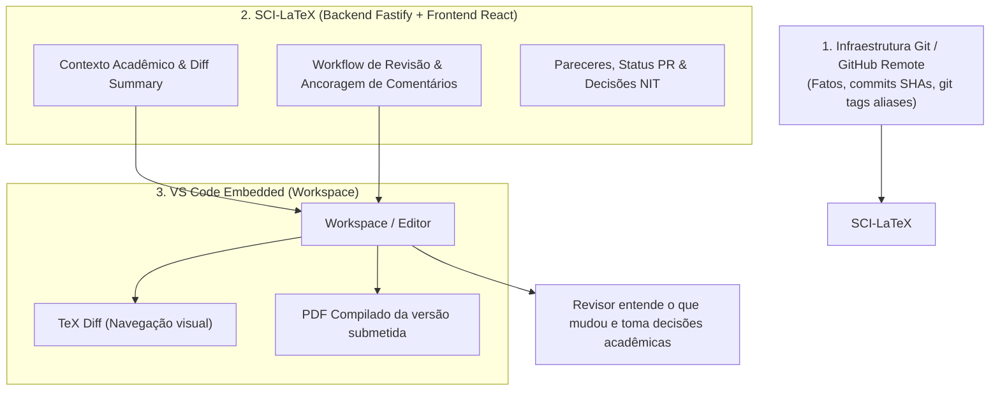

# Especificação Arquitetural e de Produto: Visão do Revisor no VS Code (`sci-latex-vscode`)

**Data da Última Atualização:** 22 de Setembro de 2026  
**Status:** Diretriz Arquitetural Aprovada (Modelo de Domínio & Diffs Consolidados)  
**Projeto:** Plataforma Web de Escrita Científica Self-Hosted (`sci-latex-vscode`)

---

## 1. Decisão Fundamental de Produto & Separação de Camadas

> [!IMPORTANT]
> **Modelo Mental Acadêmico:**  
> O revisor está revisando um **Artigo Científico**, e não simplesmente arquivos de código LaTeX.  
> O VS Code é a infraestrutura/editor de alta performance, mas **NÃO** define o modelo mental ou o workflow da revisão. A aplicação **SCI-LaTeX (React/Fastify)** é a detentora do contexto acadêmico, das decisões de domínio e do ciclo de vida das revisões.



---

## 2. Modelo de Domínio Estrito: Rodadas de Revisão e Fotografia Imutável

Para garantir que a revisão nunca acompanhe a ponta móvel da branch da tarefa (que continua evoluindo com novos commits), o domínio do **SCI-LaTeX** captura o commit exato como uma **fotografia lógica imutável** no momento do envio para revisão.

### 2.1 Interface de Domínio de Rodada (`ReviewRound`)

O SHA do commit é a **única fonte da verdade** no modelo de domínio:

```typescript
export interface ReviewRound {
  id: string;
  prId: string;
  roundNumber: number;                  // Ex: 1, 2, 3...
  
  // Hashing estrito e imutável dos estados do repositório (Fonte da Verdade)
  baseCommitHash: string;               // SHA da branch dev/main no momento da submissão
  submittedCommitHash: string;          // SHA exato da Task branch submetida para revisão
  previousSubmittedCommitHash?: string; // SHA exato da rodada anterior (presente na rodada >= 2)

  createdAt: Date;
}
```

> [!NOTE]
> **Git Tags como Infraestrutura / Alias de Conveniência:**  
> A infraestrutura do Git (via `GitService`) pode gerar opcionalmente uma Git Tag leve (ex: `review/pr-42-round-1 -> <submittedCommitHash>`).  
> Essa tag pertence estritamente à camada de infraestrutura para facilitar inspeções visuais no repositório Git, enquanto o modelo de domínio do SCI-LaTeX referencia unicamente o SHA do commit (`submittedCommitHash`).

### 2.2 Modelo de Comentários Ancorados (`ReviewComment`)

Os comentários pertencem a uma **rodada específica** e ao **SHA do commit submetido**, garantindo rastreabilidade histórica inalterável:

```typescript
export interface ReviewComment {
  id: string;
  reviewRoundId: string;             // Vinculado à ReviewRound
  commitHash: string;                // SHA exato do submittedCommitHash
  filePath: string;                  // Ex: "sections/01-introduction.tex"
  lineNumber: number;                // Número da linha na versão daquele commit
  content: string;
  authorId: string;
  createdAt: Date;
}
```

---

## 3. Estruturas Desacopladas de Diff no Backend (`ReviewDiff`)

O backend calcula e disponibiliza separadamente as duas perspectivas de alteração para o frontend:

```typescript
export interface ReviewDiff {
  // Perspectiva 1: Visão Geral (dev → versão submetida atual)
  overview: {
    baseCommitHash: string;          // commit dev/main (baseCommitHash)
    targetCommitHash: string;        // commit submetido atual (submittedCommitHash)
    summary: ClassifiedDiffSummary;
  };

  // Perspectiva 2: Correções Desta Rodada (versão submetida anterior → versão submetida atual)
  roundChanges?: {
    previousSubmittedCommitHash: string; // commit submetido da rodada anterior (SHA)
    currentSubmittedCommitHash: string;  // commit submetido da rodada atual (SHA)
    summary: ClassifiedDiffSummary;
  };
}
```

- **`AuthorProgressDiff` (Modal "Salvar Progresso")**: $HEAD \rightarrow Working\ Tree$ (rascunho local do autor).
- **`ReviewDiff.overview`**: $dev \rightarrow v3$ (Responde: *"Como está o artigo submetido em relação à base do projeto?"*).
- **`ReviewDiff.roundChanges`**: $v2 \rightarrow v3$ (Responde: *"O que mudou desde o meu último parecer na rodada anterior?"*).

---

## 4. Os 4 Pilares Estratégicos da Experiência de Revisão

| Pilar | Funcionalidade | Prioridade | Objetivo de UX |
| :--- | :--- | :--- | :--- |
| **Pilar A** | **Diff Automático da Submissão** | **Essencial** | Carregar o VS Code no modo `mode=review` posicionado no SHA do commit da rodada. |
| **Pilar B** | **Resumo Factual Acadêmico** | **Essencial (Diferencial)** | Painel determinístico categorizado com o impacto semântico por seções TeX. |
| **Pilar C** | **Drawer React $\leftrightarrow$ VS Code** | **Essencial** | Workflow no React e navegação de linhas no VS Code via contrato `postMessage` orientado a intenção. |
| **Pilar D** | **Visualização Dual TeX + PDF** | **Evolução Gradual** | Alternar entre código TeX e o **PDF compilado da versão submetida** (`latexdiff` fica como evolução futura). |

---

### Contrato Desacoplado de Comunicação (`postMessage`)

```typescript
type EditorMessage =
  | {
      type: 'go-to-location';
      file: string;
      line: number;
      column?: number;
    }
  | {
      type: 'selection-changed';
      file: string;
      startLine: number;
      endLine: number;
    };
```

---

## 5. Tabela de Consenso das Decisões Arquiteturais Atuais

| Decisão | Status | Justificativa |
| :--- | :--- | :--- |
| **SCI-LaTeX controla o workflow acadêmico** | ✅ Aprovado | O VS Code é o editor/workspace, não a regra de negócio. |
| **Git como infraestrutura transparente** | ✅ Aprovado | O autor e revisor interagem com o vocabulário acadêmico de artigos. |
| **Autor tem autonomia de edição** | ✅ Aprovado | Alterações fora da tarefa primária geram aviso (`hasChangesInOtherFiles`), sem bloqueio. |
| **AuthorProgressDiff $\neq$ ReviewDiff** | ✅ Aprovado | Baselines estritamente isolados ($HEAD \rightarrow WorkingTree$ vs $dev \rightarrow task$). |
| **`submittedCommitHash` como SHA Imutável** | ✅ Aprovado | O SHA é a única fonte da verdade do domínio para congelar o estado da revisão. |
| **Git Tag como Alias de Infraestrutura** | ✅ Aprovado | `review/pr-X-round-Y` criada na camada Git apenas como atalho de conveniência, fora do tipo da entidade de domínio. |
| **GitHub Releases** | ✅ Reservado | Releases mantidas exclusivamente para versões publicadas (v1.0, Camera-Ready). |
| **Comentários ancorados a Commit/Rodada** | ✅ Aprovado | Preserva o histórico mesmo quando o arquivo é totalmente reestruturado em rodadas futuras. |
| **Visualização Dual (`overview` vs `roundChanges`)** | ✅ Aprovado | Permite validar correções pontuais da rodada sem precisar reler o artigo inteiro. |
| **Comunicação React $\leftrightarrow$ VS Code** | ✅ Aprovado | `postMessage` orientado a intenção de domínio (`EditorMessage`). |
| **Backlog Futuro (Fases Posteriores)** | ⏳ Trancado | `latexdiff`, síntese generativa por IA e comentários nativos no VS Code deliberadamente adiados. |

---

## 6. Conclusão

Esta especificação consolida 100% das definições de produto, modelagem de dados e arquitetura para a **Visão do Revisor no VS Code (`sci-latex-vscode`)**, pronta para servir como guia oficial durante o desenvolvimento da funcionalidade.
